# Run the creator journey on regtest

From the repository root, with Bun 1.3.5, `tar`, and `openssl` available:

```sh
bun install --frozen-lockfile
bun run regtest
```

The command downloads and verifies pinned Bitcoin Core 31.1 and ord 0.29.0
release archives on Apple Silicon macOS or x86-64 Linux, builds the packages,
typechecks the harness, and runs three isolated journeys, the no-address-index
capability check, and the Core/ord restart proof. Each creates a temporary chain and wallet,
mines its own coins, and uses loopback RPC, ord, indexer, and HTTPS services.
No public Bitcoin network or paid faucet is used. The script stops its nodes on normal
completion or a caught failure; temporary data and logs remain for diagnosis.

The default journey uses a tiny PNG. To use your own PNG and retain receipts:

```sh
REGTEST_PNG=/absolute/path/art.png \
REGTEST_RECEIPT=/absolute/path/receipt.json \
REGTEST_LOGS_DIR=/absolute/path/regtest-logs \
bun run regtest
```

Receipts are written as `receipt-none.json`, `receipt-reveal-rejected.json`, and
`receipt-commit-response-lost.json`, plus `receipt-no-address-index.json` and
`receipt-restart.json`. Each journey includes actual binary versions,
transaction and inscription IDs, the orphaned block and active tip, the content
hash, and the temporary data directory. The runner accepts PNGs up to the local
hosting service's 256 KiB object limit. The interactive landing file picker has
a separate 32 KiB limit.

`REGTEST_LOGS_DIR` copies Core and ord stdout/stderr into a directory per scenario
on normal completion or caught failure. CI uploads these logs even when an
assertion fails before a receipt can be written.

Use `REGTEST_FAULT=none`, `reveal-rejected`, or `commit-response-lost` to run one
scenario. Use `REGTEST_TOOLS_DIR` to select an archive cache. Alternatively set
**both** `BITCOIND_BIN` and `ORD_BIN` to explicit binaries; this skips installation
and reports their actual versions. Only the pinned versions have been validated
here. `bun run regtest:install` downloads/verifies/extracts without starting nodes.

## What the run proves

```mermaid
flowchart LR
  P[PNG bytes] --> C[Create signed CEL]
  C --> W[Publish through HTTPS handlers]
  W --> D[Fresh WebVH resolution]
  D --> F[HTTP deposit and sat selection]
  F --> S[Build and sign commit + reveal]
  S --> R[Persist pair before broadcast]
  R --> B[Bitcoin Core regtest]
  B --> O[ord index]
  O --> V[Fresh verified sat and DID resolution]
  V --> J[Version 4 JSON export and reload]
```



All three runs check exact PNG bytes and hashes, the selected sat's identity,
and real node acceptance of signed transactions. The fault cases inject either
one rejected reveal submission or a lost response after Core accepts the commit.
The app recreates its route and store instances from disk, completes the saved
pair idempotently, and confirms it. This is persistence recovery across instance
recreation, not a claimed operating-system crash test.

Every scenario also invalidates the first confirmation block. Core status must
become unconfirmed and the app must demote the record and preserve/rebroadcast
its signed pair. The runner advances mock time and mines a replacement branch
higher than the old tip so ord 0.29.0 notices and indexes the reorganization.
Fresh SDK instances then verify and recover the asset from the sat alone.

## Bytes and format compatibility

Runtime resource content is `Uint8Array`. Strings are accepted at creation
boundaries and encoded as UTF-8. Hashes, byte counts, hosted bodies, and ordinal
content use the original bytes. New SDK envelopes use version 4 and canonical
`ni` asset identity; strict version-3 Originals envelopes remain readable.
The signed event format is unchanged CEL 3. See
[the current identity contract](../../specs/originals-asset-identity.md) and
[SDK 4 migration](../MIGRATION_4.0.md).

The journey verifies raw media with CEL CBOR metadata at the Bitcoin boundary,
then exact delta publications (including log-only `application/cel` bodies),
controller rotation, sale/reacquisition, reorgs and deactivation. No DID document
is inscribed. It enforces the [inscription decision](../../specs/btco-inscription-shape.md).

## SDK and landing configuration

A standalone SDK can use the exported `RegtestProvider`:

```ts
const provider = new RegtestProvider({
  rpcUrl: 'http://127.0.0.1:18443',
  ordUrl: 'http://127.0.0.1:8080',
  rpcAuth: cookieContents,
});
const sdk = OriginalsSDK.create({
  network: 'regtest', webvhNetwork: 'magby', ordinalsProvider: provider,
});
```

The provider requires explicit HTTP loopback URLs, Core's `regtest` chain, and
healthy ord sat/address indexes. Sat reads require ord's height **and block hash**
to agree with Core. During index lag, reads fail until the nodes agree. Core
supplies broadcast, previous transactions, and active-chain confirmation status.
The test fee is explicitly fixed at 2 sat/vB, not a public-network fee estimate.

The normal landing server accepts `BTC_NETWORK=regtest` with
`VITE_BTC_NETWORK=regtest`, `REGTEST_RPC_URL`, `REGTEST_ORD_URL`,
`REGTEST_RPC_AUTH`, and `BTC_INDEXER_API`. The indexer must be explicit loopback
Esplora-compatible HTTP; `server/regtest.ts` supplies this adapter for a local
Core/ord provider. `scripts/regtest/environment.ts` can run the two nodes directly;
the complete journey additionally starts the indexer and HTTPS app.
The regular server still needs its normal auth/hosting configuration. A regtest
funding address uses `bcrt1`; the Turnkey account identifier uses the corresponding
`tb1` encoding of the same witness program. Testnet4 is not part of this profile.

## Browser, restart and release boundaries

- `bun run regtest:browser` additionally drives the actual creator UI in Chromium,
  persists the signed pair, restarts the browser, server, Core and ord, and
  finishes that exact inscription without another signature. See
  [browser verification](browser-verification.md) for fixture boundaries and
  [restart verification](restart-verification.md) for Core-only, ord-only and
  combined restart assertions.
- These runs use disposable local keys through the existing signer adapters and
  an authenticated local fixture session. Actual hosted Turnkey issuance and
  remote custody remain separate production validation gates.
- Recovery artifacts are retained through early confirmation and retired at six
  confirmations. Six is a storage/recovery horizon, **not Bitcoin finality**.
  Deep reorgs after retirement, fee replacement, power loss and concurrent
  production writers need separate rehearsals.
- The workflow requires HTTP journeys, node restarts and both browser fault
  scenarios, and uploads failure artifacts. Earlier hosted Linux results are
  recorded in the release evidence; each new change still requires its own CI run.
- SDK 3.0.0 was published. The identity correction records an SDK 4 / CEL 2 major
  changeset; local regtest does not publish packages or establish a public-host
  or mainnet acceptance gate.

The [September 5 validation record](validation.md) is historical. Current
completion evidence is linked from the browser/restart documents and release record.
