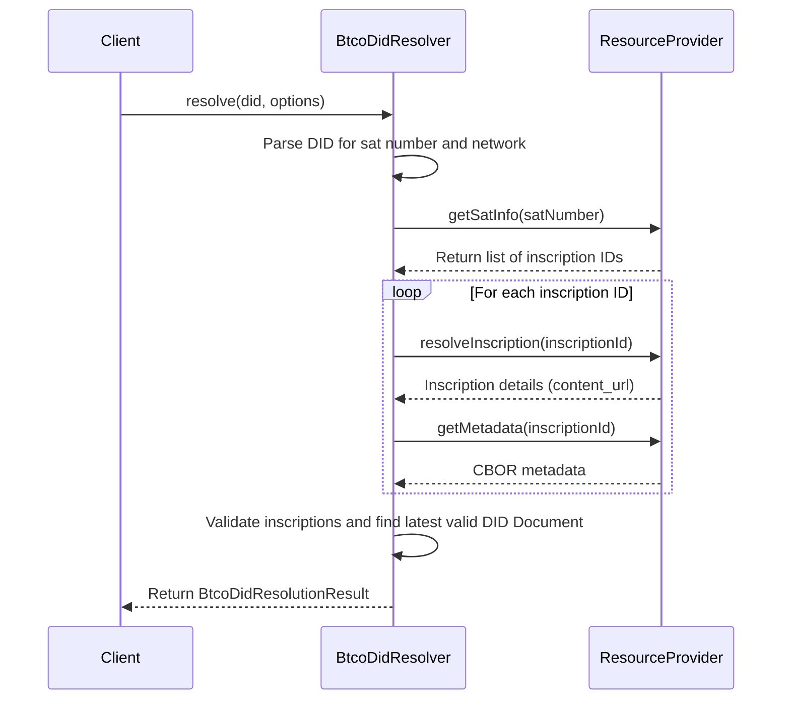

# DIDs

This section provides the API documentation for functionalities related to Decentralized Identifiers (DIDs). It covers the `BtcoDidResolver` for resolving `did:btco` identifiers and a suite of utility functions for creating, validating, and managing DID Documents.

For a conceptual understanding of how DIDs work within this system, please refer to the [BTCO DIDs](./core-concepts-btco-dids.md) core concepts page.

## BtcoDidResolver

The `BtcoDidResolver` class is the primary tool for resolving a `did:btco` string. It retrieves all inscriptions on the associated satoshi, processes their content and metadata, and constructs a resolution result that includes the final DID Document.

### Resolution Flow

The following diagram illustrates the process of resolving a DID:



### resolve()

Resolves a BTCO DID according to the specification. It fetches all inscriptions on the satoshi, validates them, and returns the most recent valid DID document along with comprehensive metadata.

**Parameters**

| Name      | Type                       | Description                                                                                                                              |
| :-------- | :------------------------- | :--------------------------------------------------------------------------------------------------------------------------------------- |
| `did`     | `string`                   | The full BTCO DID string to resolve (e.g., `did:btco:test:123456789`).                                                                    |
| `options` | `BtcoDidResolutionOptions` | Optional configuration. The primary option is `provider` to specify a custom `ResourceProvider` for fetching on-chain data.                 |

**Returns** `Promise<BtcoDidResolutionResult>`

A promise that resolves to a `BtcoDidResolutionResult` object containing the resolution state.

**Example**

```javascript
import { BtcoDidResolver } from './ordinals-plus';

const resolver = new BtcoDidResolver();
const didToResolve = 'did:btco:255333333333'; // Example DID

async function resolveDid() {
  try {
    const result = await resolver.resolve(didToResolve);
    if (result.didDocument) {
      console.log('Resolved DID Document:', JSON.stringify(result.didDocument, null, 2));
    } else {
      console.error('Failed to resolve DID:', result.resolutionMetadata.error);
    }
    console.log('Total inscriptions found:', result.inscriptions?.length);
  } catch (error) {
    console.error('An unexpected error occurred:', error);
  }
}

resolveDid();
```

**Example Response (`BtcoDidResolutionResult`)**

```json
{
  "didDocument": {
    "@context": [
      "https://www.w3.org/ns/did/v1",
      "https://w3id.org/security/suites/ed25519-2020/v1"
    ],
    "id": "did:btco:255333333333",
    "verificationMethod": [
      {
        "id": "did:btco:255333333333#key-1",
        "type": "Ed25519VerificationKey2020",
        "controller": "did:btco:255333333333",
        "publicKeyMultibase": "z6Mkt..."
      }
    ],
    "authentication": [
      "did:btco:255333333333#key-1"
    ]
  },
  "inscriptions": [
    {
      "inscriptionId": "a1b2c3...i0",
      "content": "This is an older, unrelated inscription.",
      "metadata": null,
      "isValidDid": false
    },
    {
      "inscriptionId": "d4e5f6...i1",
      "content": "BTCO DID: did:btco:255333333333",
      "metadata": { /* ... DID Document fields ... */ },
      "contentUrl": "https://provider.com/content/d4e5f6...i1",
      "contentType": "text/plain",
      "isValidDid": true,
      "didDocument": { /* ... DID Document ... */ }
    }
  ],
  "resolutionMetadata": {
    "inscriptionId": "d4e5f6...i1",
    "satNumber": "255333333333",
    "network": "mainnet",
    "totalInscriptions": 2
  },
  "didDocumentMetadata": {
    "inscriptionId": "d4e5f6...i1",
    "network": "mainnet"
  }
}
```

## DID Document Management

These functions are used to create and manipulate DID Document objects in memory before they are inscribed on-chain. They follow the W3C DID Core specifications.

### createDidDocument()

Creates a new DID Document for a given satoshi number and network, including an initial Ed25519 key pair.

**Parameters**

| Name        | Type                         | Description                                                                                             |
| :---------- | :--------------------------- | :------------------------------------------------------------------------------------------------------ |
| `satNumber` | `number` \| `string`         | The satoshi number to associate with the DID.                                                           |
| `network`   | `BitcoinNetwork`             | The Bitcoin network (`'mainnet'`, `'testnet'`, `'signet'`). Defaults to `'mainnet'`.                    |
| `options`   | `CreateDidDocumentOptions`   | Optional settings, such as `controller`, `services`, and `deactivated` status.                          |

**Returns** `Promise<DidDocumentWithKeys>`

An object containing the `document`, `publicKey`, and `secretKey`.

**Example**

```javascript
import { createDidDocument } from './ordinals-plus';

async function createNewDid() {
  const satNumber = '255333333333';
  const network = 'mainnet';

  const { document, publicKey, secretKey } = await createDidDocument(satNumber, network, {
    services: [{
      id: `${did}#my-service`,
      type: 'MyServiceType',
      serviceEndpoint: 'https://example.com/service'
    }]
  });

  console.log('New DID Document:', document);
  console.log('Public Key (Uint8Array):', publicKey);
}

createNewDid();
```

### addKeyToDidDocument()

Adds a new cryptographic key and verification method to an existing DID Document.

**Parameters**

| Name      | Type            | Description                                                                                  |
| :-------- | :-------------- | :------------------------------------------------------------------------------------------- |
| `document`| `DidDocument`   | The DID Document to modify.                                                                  |
| `keyPair` | `KeyPair`       | An object containing the new key material (`publicKey`, `secretKey`, `type`).                |
| `options` | `AddKeyOptions` | Optional settings, including a custom `id`, `controller`, and verification `relationships`.  |

**Returns** `Promise<DidDocument>`

The updated DID Document object.

### rotateKeyInDidDocument()

Replaces an existing key in a DID Document with a new one, transferring all verification relationships.

**Parameters**

| Name         | Type                | Description                                                                           |
| :----------- | :------------------ | :------------------------------------------------------------------------------------ |
| `document`   | `DidDocument`       | The DID Document to modify.                                                           |
| `oldKeyId`   | `string`            | The full ID of the key to be replaced (e.g., `did:btco:123#key-1`).                   |
| `newKeyPair` | `KeyPair`           | The new key pair to add.                                                              |
| `options`    | `RotateKeyOptions`  | Optional settings, such as `markAsRevoked` to keep the old key with a revoked status. |

**Returns** `Promise<DidDocument>`

The updated DID Document object.

### revokeKeyInDidDocument()

Marks a key as revoked within the DID Document and removes it from all verification relationships.

**Parameters**

| Name       | Type          | Description                   |
| :--------- | :------------ | :---------------------------- |
| `document` | `DidDocument` | The DID Document to modify.   |
| `keyId`    | `string`      | The full ID of the key to revoke. |

**Returns** `DidDocument`

The updated DID Document object.

### deactivateDidDocument()

Marks an entire DID Document as deactivated, which is a terminal state.

**Parameters**

| Name       | Type          | Description                         |
| :--------- | :------------ | :---------------------------------- |
| `document` | `DidDocument` | The DID Document to deactivate.     |

**Returns** `DidDocument`

The deactivated DID Document object, with `deactivated` set to `true`.

## Utility Functions

These helper functions simplify common tasks when working with BTCO DIDs.

| Function                        | Description                                                                            |
| :------------------------------ | :------------------------------------------------------------------------------------- |
| `isBtcoDid(did)`                | Checks if a given string conforms to the `did:btco:` format. Returns `boolean`.        |
| `getDidPrefix(network)`         | Returns the network-specific DID prefix (e.g., `did:btco:test`).                       |
| `createDidFromInscription(i, n)`| Constructs a DID string from an `Inscription` object and `BitcoinNetwork`.             |

**Example**

```javascript
import { isBtcoDid, getDidPrefix } from './ordinals-plus';

const validDid = 'did:btco:sig:12345';
const invalidDid = 'did:ethr:12345';

console.log(`Is '${validDid}' a BTCO DID?`, isBtcoDid(validDid)); // true
console.log(`Is '${invalidDid}' a BTCO DID?`, isBtcoDid(invalidDid)); // false

const testnetPrefix = getDidPrefix('testnet'); // 'did:btco:test'
console.log('Testnet prefix:', testnetPrefix);
```

---

Now that you can create and resolve DIDs, proceed to the [Resources](./api-reference-resources.md) section to learn how to manage DID Linked Resources associated with them.