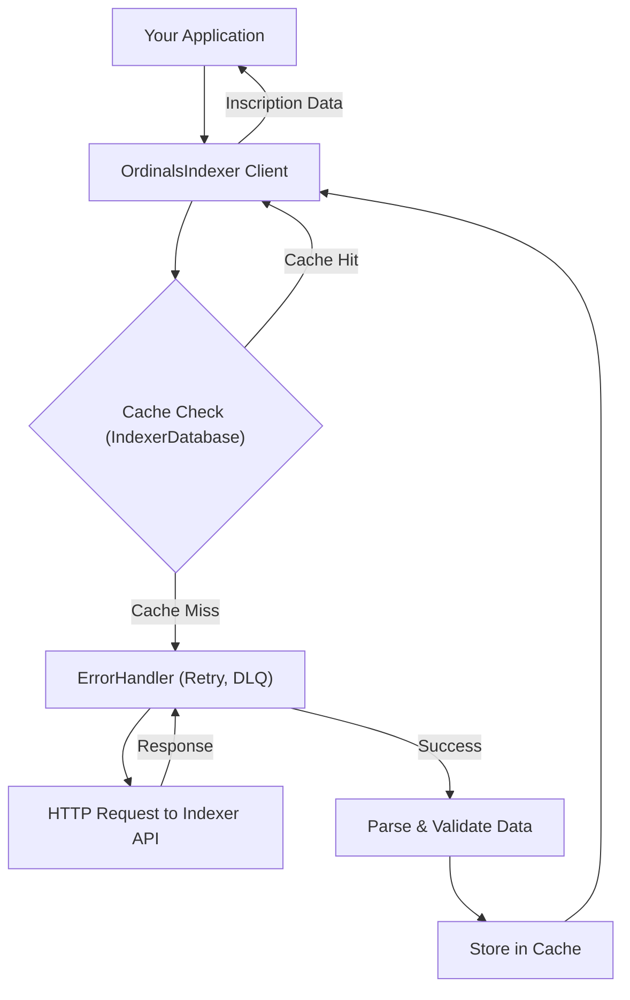

# Indexer

The `OrdinalsIndexer` client provides a robust interface for querying inscription data from an Ordinals indexer service. It is designed for resilience and performance, featuring built-in support for caching, automatic retries for failed requests, a dead-letter queue for unrecoverable errors, and efficient handling of CBOR metadata.

This client is the primary tool for fetching on-chain data related to inscriptions, which is essential for resolving DIDs and Linked Resources.

### How It Works

The client abstracts the complexity of interacting with an indexer API. When a request is made, it flows through several layers designed to ensure data integrity and availability.



## OrdinalsIndexer Class

The `OrdinalsIndexer` class is the main export of this module. You instantiate it with your indexer's configuration to begin interacting with the API.

### Instantiation

To create a client, you need to provide an `OrdinalsIndexerConfig` object. The `indexerUrl` is the only required property.

```javascript
import { OrdinalsIndexer, MemoryIndexerDatabase } from './ordinals-plus';

const config = {
  indexerUrl: 'https://api.example-indexer.com',
  apiKey: 'YOUR_API_KEY', // Optional
  timeout: 30000, // 30 seconds
  maxRetries: 3,
  enableCaching: true,
  cacheTTL: 3600000 // 1 hour
};

// For development or testing, you can use the in-memory database.
const db = new MemoryIndexerDatabase();

const indexer = new OrdinalsIndexer(config, db);
```

### Configuration (`OrdinalsIndexerConfig`)

| Parameter | Type | Description |
|---|---|---|
| `indexerUrl` | `string` | **Required.** The base URL of the Ordinals indexer API. |
| `apiKey` | `string` | Optional API key for authenticating with the indexer service. Sent as a Bearer token. |
| `timeout` | `number` | Optional. Request timeout in milliseconds. Defaults to `30000`. |
| `maxRetries` | `number` | Optional. Maximum number of retries for failed requests. Defaults to `3`. |
| `enableCaching` | `boolean` | Optional. Enables or disables caching of indexer responses. Defaults to `true`. |
| `cacheTTL` | `number` | Optional. Time-to-live for cached items in milliseconds. Defaults to `3600000` (1 hour). |
| `bitcoinRpcUrl` | `string` | Optional. Bitcoin RPC URL for direct node access if needed. |
| `bitcoinRpcAuth`| `object` | Optional. Authentication credentials (`username`, `password`) for the Bitcoin RPC. |


## Methods

### getInscriptionById

Fetches a single inscription by its unique ID.

**Parameters**

| Name | Type | Description |
|---|---|---|
| `inscriptionId` | `string` | The ID of the inscription to fetch (e.g., `i0`, `txid_i0`). |

**Returns** `Promise<IndexerInscription | null>`: The inscription object or `null` if not found.

**Example**
```javascript
async function fetchInscription(id) {
  const inscription = await indexer.getInscriptionById(id);
  if (inscription) {
    console.log('Found inscription:', inscription.number);
  } else {
    console.log('Inscription not found.');
  }
}

fetchInscription('d2971a...i0');
```

**Example Response**
```json
{
  "id": "d2971a...i0",
  "number": 12345,
  "satoshi": "1834567890123456",
  "contentType": "application/cbor",
  "hasMetadata": true,
  "timestamp": 1677643200,
  "index": 0,
  "ownerAddress": "bc1p...",
  "txid": "d2971a...",
  "contentLength": 256
}
```

### searchInscriptions

Performs a paginated search for inscriptions based on various criteria.

**Parameters**

| Name | Type | Description |
|---|---|---|
| `params` | `InscriptionSearchParams` | An object containing search filters. See table below. |

**`InscriptionSearchParams`**

| Parameter | Type | Description |
|---|---|---|
| `page` | `number` | Page number for pagination (1-based). |
| `limit` | `number` | Number of items per page. |
| `contentType` | `string` | Filter by a specific MIME content type (e.g., 'text/plain'). |
| `address` | `string` | Filter by the current owner's address. |
| `hasMetadata` | `boolean` | If true, only return inscriptions that have associated metadata. |
| `blockHeight`| `object` | Filter by a block height range with `min` and/or `max` properties. |
| `timestamp` | `object` | Filter by a creation date range with `from` and/or `to` `Date` objects. |
| `nextPageToken`| `string` | A continuation token from a previous response to fetch the next page. |

**Returns** `Promise<PaginatedResponse<IndexerInscription>>`: A paginated response object containing the list of matching inscriptions.

**Example**
```javascript
async function findRecentTextInscriptions() {
  const results = await indexer.searchInscriptions({
    contentType: 'text/plain',
    limit: 10,
    timestamp: {
      from: new Date(Date.now() - 24 * 60 * 60 * 1000) // Last 24 hours
    }
  });

  console.log(`Found ${results.total} text inscriptions in the last 24 hours.`);
  results.items.forEach(item => console.log(`- Inscription #${item.number}`));
}

findRecentTextInscriptions();
```

**Example Response**
```json
{
  "items": [
    {
      "id": "a1b2c3...i0",
      "number": 50001,
      "satoshi": "19...",
      "contentType": "text/plain",
      "hasMetadata": false,
      "timestamp": 1677643200,
      "index": 0,
      "ownerAddress": "bc1q...",
      "txid": "a1b2c3...",
      "contentLength": 42
    }
  ],
  "total": 1,
  "page": 1,
  "pageSize": 10
}
```

### getInscriptionContent

Fetches the raw binary content of an inscription.

**Parameters**

| Name | Type | Description |
|---|---|---|
| `inscriptionId` | `string` | The ID of the inscription whose content is to be fetched. |

**Returns** `Promise<Buffer | null>`: A `Buffer` containing the raw content or `null` if not found.

**Example**
```javascript
async function downloadContent(id) {
  const contentBuffer = await indexer.getInscriptionContent(id);
  if (contentBuffer) {
    console.log(`Content size: ${contentBuffer.length} bytes`);
    // E.g., save to a file
    // fs.writeFileSync('inscription-content.dat', contentBuffer);
  } else {
    console.log('Content not found.');
  }
}

downloadContent('d2971a...i0');
```

### getInscriptionMetadata

Fetches, decodes, and caches CBOR metadata from an inscription. Requires a database (`IndexerDatabase`) to be configured in the constructor.

**Parameters**

| Name | Type | Description |
|---|---|---|
| `inscriptionId` | `string` | The ID of the inscription whose metadata is to be fetched. |

**Returns** `Promise<any | null>`: The decoded JavaScript object from the CBOR metadata, or `null` if no metadata exists.

**Example**
```javascript
async function fetchMetadata(id) {
  const metadata = await indexer.getInscriptionMetadata(id);
  if (metadata) {
    console.log('Decoded Metadata:', metadata);
  } else {
    console.log('No metadata found for this inscription.');
  }
}

fetchMetadata('d2971a...i0');
```

**Example Response**
```json
{
  "didDocument": {
    "id": "did:btco:tx:d2971a...-i0",
    "@context": "https://www.w3.org/ns/did/v1"
  }
}
```

## Caching and Persistence

The indexer client is designed to work with a caching layer to reduce redundant API calls and improve performance. This is managed through the `IndexerDatabase` interface.

While you can implement your own persistent database connector (e.g., using PostgreSQL or Redis), the library includes a simple `MemoryIndexerDatabase` for easy setup in development environments or scenarios where persistence is not required.

```javascript
import { OrdinalsIndexer, MemoryIndexerDatabase } from './ordinals-plus';

// Using the in-memory database for caching
const db = new MemoryIndexerDatabase();

const indexer = new OrdinalsIndexer({
  indexerUrl: 'https://api.example-indexer.com'
}, db);

// First call will hit the API
await indexer.getInscriptionById('some-id');

// Subsequent call will be served from memory
await indexer.getInscriptionById('some-id');
```

---

With the `OrdinalsIndexer`, you can reliably access the on-chain data required by other parts of the library. To learn about utility functions that help in processing this data, see the [Utilities](./api-reference-utilities.md) section.