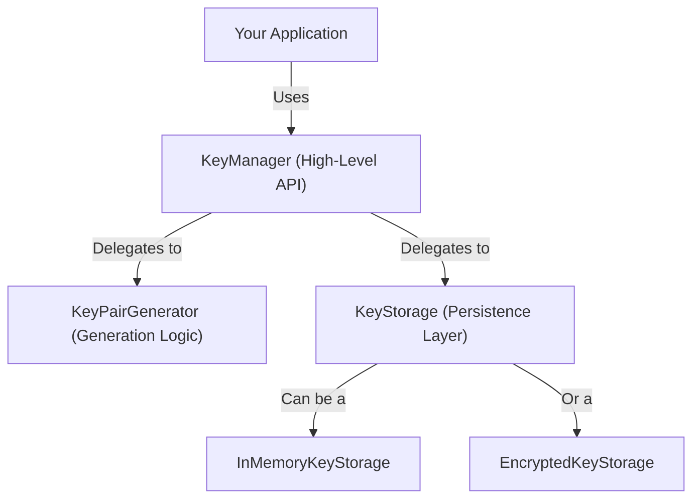

# Key Management

The Key Management module provides a comprehensive system for generating, storing, and managing the cryptographic keys required for interacting with BTCO DIDs and signing Bitcoin transactions. It offers a high-level API through the `KeyManager` class, abstracting the complexities of key generation and storage.

The core components are:
- **`KeyManager`**: A high-level class that orchestrates key generation, storage, and cryptographic operations.
- **`KeyPairGenerator`**: A low-level utility for creating cryptographic key pairs of various types.
- **`KeyStorage`**: An interface for key persistence, with in-memory and encrypted implementations available.

### Module Architecture

The relationship between the main components can be visualized as follows:



## `KeyManager` Class

The `KeyManager` class is the primary entry point for all key management operations. It combines key generation and storage into a unified API.

### Instantiation

You can create a new `KeyManager` instance or use the singleton pattern.

```javascript
import { KeyManager } from './key-manager';

// Default instance with in-memory storage
const keyManager = new KeyManager();

// Instance with custom options
const customManager = new KeyManager({
  defaultKeyType: 'secp256k1',
  defaultNetwork: 'testnet',
});

// Using the singleton instance
const singletonManager = KeyManager.getInstance();
```

#### `KeyManagerOptions`

| Parameter | Type | Description |
|---|---|---|
| `storage` | `KeyStorage` | Optional. A storage provider instance. Defaults to `InMemoryKeyStorage`. |
| `defaultKeyType` | `KeyType` | Optional. The default key type to generate. Defaults to `'Ed25519'`. |
| `defaultNetwork` | `string` | Optional. The default network for keys. Defaults to `'mainnet'`. |

### Methods

#### `createKey()`

Generates and stores a new key pair.

| Parameter | Type | Description |
|---|---|---|
| `options` | `Partial<KeyPairGeneratorOptions & { aliases?: string[] }>` | Optional. Key generation options, such as `type`, `network`, and a list of aliases. |
| `alias` | `string` | Optional. A primary alias for the key. |

**Returns:** `Promise<string>` - The ID of the generated key.

**Example**
```javascript
const keyId = await keyManager.createKey(
  { type: 'secp256k1', network: 'testnet', aliases: ['backup-key'] },
  'primary-signing-key'
);
console.log('Created key ID:', keyId);
```

**Example Response**
```
"5a1b3c4d..."
```

#### `importKey()`

Imports an existing private key and stores it.

| Parameter | Type | Description |
|---|---|---|
| `privateKey` | `Uint8Array` | The private key to import. |
| `type` | `KeyType` | The type of the key (`'Ed25519'`, `'secp256k1'`, `'schnorr'`). |
| `alias` | `string` | Optional. An alias for the imported key. |
| `network` | `string` | Optional. The network associated with the key. |

**Returns:** `Promise<string>` - The ID of the imported key.

**Example**
```javascript
import { randomBytes } from '@noble/hashes/utils';

// Example private key (use a real one in practice)
const privateKey = randomBytes(32);

const importedKeyId = await keyManager.importKey(
  privateKey,
  'secp256k1',
  'imported-wallet-key'
);
console.log('Imported key ID:', importedKeyId);
```

#### `getKey()` / `getKeyByAlias()`

Retrieves a stored key pair by its ID or alias.

**Returns:** `Promise<KeyPair | null>` - The key pair object or `null` if not found.

**Example**
```javascript
const keyById = await keyManager.getKey(keyId);
console.log('Retrieved by ID:', keyById.type);

const keyByAlias = await keyManager.getKeyByAlias('primary-signing-key');
console.log('Retrieved by Alias:', keyByAlias.id);
```

**Example Response (`getKey`)**
```json
{
  "id": "5a1b3c4d...",
  "type": "secp256k1",
  "privateKey": { "type": "Buffer", "data": [...] },
  "publicKey": { "type": "Buffer", "data": [...] },
  "network": "testnet",
  "createdAt": "2023-10-27T10:00:00.000Z"
}
```

#### `sign()`

Signs a piece of data using the private key associated with the given ID or alias.

| Parameter | Type | Description |
|---|---|---|
| `idOrAlias` | `string` | The ID or alias of the key to use for signing. |
| `data` | `Uint8Array` | The data to sign. |

**Returns:** `Promise<Uint8Array>` - The resulting signature.

**Example**
```javascript
const message = new TextEncoder().encode('Sign this data for verification');
const signature = await keyManager.sign('primary-signing-key', message);
console.log('Signature created:', signature);
```

#### `verify()`

Verifies a signature against the original data and a public key.

| Parameter | Type | Description |
|---|---|---|
| `idOrAlias` | `string` | The ID or alias of the key used for verification. |
| `data` | `Uint8Array` | The original data that was signed. |
| `signature` | `Uint8Array` | The signature to verify. |

**Returns:** `Promise<boolean>` - `true` if the signature is valid, otherwise `false`.

**Example**
```javascript
const isSignatureValid = await keyManager.verify(
  'primary-signing-key',
  message,
  signature
);
console.log('Is signature valid?', isSignatureValid);
```

**Example Response**
```
true
```

#### `rotateKey()`

Replaces an existing key with a new one, optionally archiving the old key.

| Parameter | Type | Description |
|---|---|---|
| `idOrAlias` | `string` | The ID or alias of the key to rotate. |
| `options` | `KeyRotationOptions` | Optional. Configuration for the rotation process. |

**Returns:** `Promise<string>` - The ID of the new key.

**Example**
```javascript
const newKeyId = await keyManager.rotateKey('primary-signing-key', { archiveOldKey: true });
console.log(`Key rotated. Old key archived, new key ID is ${newKeyId}`);
```

#### `revokeKey()`

Marks a key as revoked by adding metadata. Revoked keys cannot be used for signing.

| Parameter | Type | Description |
|---|---|---|
| `idOrAlias` | `string` | The ID or alias of the key to revoke. |
| `reason` | `string` | Optional. A reason for the revocation. |

**Returns:** `Promise<boolean>` - `true` if the key was successfully revoked.

**Example**
```javascript
await keyManager.revokeKey('backup-key', 'Key was compromised');
const isRevoked = await keyManager.isKeyRevoked('backup-key');
console.log('Is key revoked?', isRevoked);
```

## `KeyPairGenerator` Class

This static class provides low-level functions for generating different types of cryptographic key pairs. It is used internally by `KeyManager` but can also be used directly.

#### `generate()`

Generates a standard `KeyPair` object based on the provided options.

| Parameter | Type | Description |
|---|---|---|
| `options` | `KeyPairGeneratorOptions` | Configuration for key generation, including `type`, `network`, and `entropy`. |

**Returns:** `Promise<KeyPair>` - The generated key pair object.

**Example**
```javascript
import { KeyPairGenerator } from './key-pair-generator';

const keyPair = await KeyPairGenerator.generate({ 
  type: 'schnorr', 
  network: 'mainnet' 
});
console.log('Generated Schnorr key pair:', keyPair.id);
```

## `KeyStorage`

The `KeyStorage` interface defines a standard contract for storing, retrieving, and deleting keys. Two implementations are provided.

### `InMemoryKeyStorage`

A basic, non-persistent storage implementation that keeps keys in memory. This is the default storage provider for `KeyManager` and is suitable for testing and development environments where data does not need to persist across sessions.

### `EncryptedKeyStorage`

A storage wrapper that encrypts key pairs before persisting them to a backing storage provider (like `InMemoryKeyStorage`). It uses a master password to derive an encryption key, providing a secure way to store sensitive key material.

**Example**
```javascript
import { EncryptedKeyStorage, InMemoryKeyStorage } from './key-storage';

// The encrypted storage uses another storage instance as its backing layer
const backingStore = new InMemoryKeyStorage();

const encryptedStorage = new EncryptedKeyStorage({
  masterPassword: 'your-strong-secret-password',
  backingStorage: backingStore,
});

const secureKeyManager = new KeyManager({ storage: encryptedStorage });

const secureKeyId = await secureKeyManager.createKey({ type: 'Ed25519' }, 'my-encrypted-key');
console.log('Created key in encrypted storage:', secureKeyId);
```

## Data Structures

#### `KeyPair`

```typescript
interface KeyPair {
  id: string;
  type: KeyType;
  privateKey: Uint8Array;
  publicKey: Uint8Array;
  network?: Network;
  createdAt: Date;
  metadata?: Record<string, any>;
}
```

#### `KeyType`

A string literal type for supported key algorithms.

```typescript
type KeyType = 'Ed25519' | 'secp256k1' | 'schnorr';
```

---

After managing keys, the next step is often to use them to create and sign transactions. For more information, see the [Transactions API Reference](./api-reference-transactions.md).
