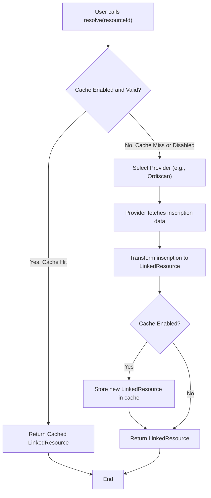

# Resources

The Resources module provides the tools to fetch and manage DID Linked Resources, which are digital assets inscribed on the Bitcoin blockchain. The primary interface for this is the `ResourceResolver`, a class designed to resolve resource identifiers into structured data, manage different data sources through a provider system, and implement caching for performance.

For a higher-level understanding of how Linked Resources fit into the ecosystem, please see the [Linked Resources](./core-concepts-linked-resources.md) section in Core Concepts.

## Resource Resolution Flow

The `ResourceResolver` follows a clear process to fetch a resource, which includes checking a local cache before querying an external data provider.



## `ResourceResolver`

The `ResourceResolver` is the main class for fetching resource data. It is initialized with configuration that specifies the network and data provider details.

### Initialization

To begin, create an instance of `ResourceResolver`. You can customize its behavior through the `ResourceResolverOptions`.

**Parameters (`ResourceResolverOptions`)**

| Option | Type | Description |
|---|---|---|
| `apiEndpoint` | `string` | Optional. The API endpoint URL for the data provider. Defaults to a public Ordiscan endpoint. |
| `apiKey` | `string` | Optional. An API key for services like Ordiscan. Can also be set via the `ORDISCAN_API_KEY` environment variable. |
| `timeout` | `number` | Optional. The request timeout in milliseconds. Defaults to `5000`. |
| `network` | `'mainnet' \| 'testnet' \| 'signet' \| 'regtest'` | Optional. The Bitcoin network to use. Defaults to `'mainnet'`. |
| `cacheEnabled` | `boolean` | Optional. If `true`, resolution results will be cached in memory. Defaults to `true`. |
| `cacheTtl` | `number` | Optional. The cache Time-to-Live in milliseconds. Defaults to `300000` (5 minutes). |

**Example**

```typescript
import { ResourceResolver } from '@btco/did-sdk';

// Initialize resolver for the mainnet with default settings
const resolver = new ResourceResolver();

// Initialize resolver for testnet with custom caching disabled
const testnetResolver = new ResourceResolver({
  network: 'testnet',
  cacheEnabled: false,
});
```

### `resolve()`

Resolves a full `LinkedResource` object from a resource identifier string.

**Parameters**

| Name | Type | Description |
|---|---|---|
| `resourceId` | `string` | The unique identifier of the resource (e.g., `did:btco:s...#0`). |
| `options.noCache` | `boolean` | Optional. If `true`, this specific request will bypass the cache. Defaults to `false`. |

**Returns**

- `Promise<LinkedResource>`: A promise that resolves to the `LinkedResource` object.

**Example**

```typescript
async function getResource(resourceId: string) {
  try {
    const resource = await resolver.resolve(resourceId);
    console.log('Resolved Resource:', resource);
    // You can now access resource.content, resource.type, etc.
  } catch (error) {
    console.error('Failed to resolve resource:', error.message);
  }
}

// Example DID Linked Resource ID
const resourceId = 'did:btco:s123456789012345#0';
getResource(resourceId);
```

**Example Response (`LinkedResource`)**

```json
{
  "id": "did:btco:s560380318023795#0",
  "type": "image/png",
  "did": "did:btco:s560380318023795",
  "contentUrl": "https://api.ordiscan.com/v1/content/a1b2c3d4...i0",
  "contentType": "image/png",
  "content": "<Promise>",
  "metadata": null,
  "inscriptionId": "a1b2c3d4...i0",
  "inscriptionNumber": 12345
}
```
Note: The `content` property is a promise that resolves to the resource's raw data as a `Uint8Array`.

### `resolveInfo()`

Fetches metadata about a resource without downloading its content. This is a lighter-weight operation ideal for listing resources or checking types.

**Parameters**

| Name | Type | Description |
|---|---|---|
| `resourceId` | `string` | The unique identifier of the resource. |
| `options.noCache` | `boolean` | Optional. If `true`, bypass the cache for this request. Defaults to `false`. |

**Returns**

- `Promise<ResourceInfo>`: A promise that resolves to the `ResourceInfo` object.

**Example**

```typescript
async function getResourceInfo(resourceId: string) {
  try {
    const info = await resolver.resolveInfo(resourceId);
    console.log('Resource Info:', info);
  } catch (error) {
    console.error('Failed to resolve resource info:', error.message);
  }
}

getResourceInfo('did:btco:s123456789012345#0');
```

**Example Response (`ResourceInfo`)**

```json
{
  "id": "did:btco:s560380318023795#0",
  "type": "text/plain",
  "contentType": "text/plain",
  "createdAt": "2023-01-01T12:00:00.000Z",
  "updatedAt": "2023-01-01T12:00:00.000Z",
  "content_url": "https://api.ordiscan.com/v1/content/a1b2c3d4...i0",
  "inscriptionId": "a1b2c3d4...i0",
  "didReference": "did:btco:s560380318023795",
  "sat": 560380318023795
}
```

### `resolveCollection()`

Resolves all resources associated with a given BTCO DID. This is useful for fetching all inscriptions on a specific satoshi.

**Parameters**

| Name | Type | Description |
|---|---|---|
| `did` | `string` | The BTCO DID (e.g., `did:btco:s...`). |
| `options.type` | `string` | Optional. Filter resources by a specific content type. |
| `options.limit` | `number` | Optional. The maximum number of resources to return. |
| `options.offset` | `number` | Optional. The number of resources to skip from the beginning. |

**Returns**

- `Promise<LinkedResource[]>`: A promise that resolves to an array of `LinkedResource` objects.

**Example**

```typescript
async function getCollection(did: string) {
  try {
    // Get the first 5 image resources for a DID
    const imageResources = await resolver.resolveCollection(did, {
      type: 'image/png',
      limit: 5,
      offset: 0
    });
    console.log(`Found ${imageResources.length} image resources.`);
  } catch (error) {
    console.error('Failed to resolve collection:', error.message);
  }
}

getCollection('did:btco:s123456789012345');
```

**Example Response**

```json
[
  {
    "id": "did:btco:s123456789012345#0",
    "type": "image/png",
    "did": "did:btco:s123456789012345",
    "contentUrl": "...",
    "contentType": "image/png",
    "content": "<Promise>",
    "metadata": null,
    "inscriptionId": "...i0",
    "inscriptionNumber": 12345
  },
  {
    "id": "did:btco:s123456789012345#1",
    "type": "image/png",
    "did": "did:btco:s123456789012345",
    "contentUrl": "...",
    "contentType": "image/png",
    "content": "<Promise>",
    "metadata": null,
    "inscriptionId": "...i1",
    "inscriptionNumber": 12346
  }
]
```

## Data Providers

The `ResourceResolver` uses a provider model to abstract the source of Ordinals data. The library includes providers for common services.

- **`OrdiscanProvider`**: The default provider, which uses the [Ordiscan API](https://ordiscan.com/). It requires an API key for most operations.
- **`OrdNodeProvider`**: Connects to a self-hosted `ord` node. This provides a decentralized way to fetch data without relying on a third-party service.

The provider is typically configured automatically when you instantiate `ResourceResolver`, but you can create them directly for advanced use cases.

---

With the ability to resolve resources and collections, you have the tools needed to read data associated with DIDs. To learn how to create new DIDs and inscribe resources, proceed to the [Transactions](./api-reference-transactions.md) API reference.