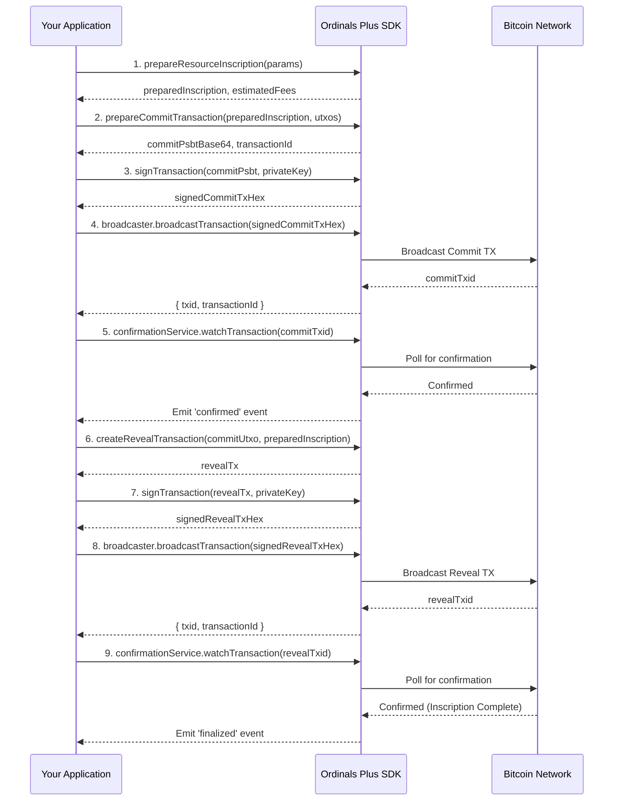

# Transactions

This section provides a detailed API reference for creating, signing, and broadcasting Bitcoin transactions required for inscriptions. It covers the entire lifecycle, from preparing the inscription data to confirming the final transaction on the blockchain.

The process involves a two-phase commit and reveal sequence to ensure the inscription is valid and properly funded.

### Transaction Lifecycle Flow

The following diagram illustrates the complete sequence for creating an inscription, from preparation to final confirmation.



---

## prepareResourceInscription

This is the initial step for creating an inscription. It prepares the content, generates necessary scripts, derives the commit address, and estimates the fees required for the reveal transaction.

**Parameters**

| Name | Type | Description |
|---|---|---|
| `params` | `ResourceCreationParams` | An object containing all necessary parameters for inscription. |
| `params.content` | `string` or `Buffer` | The content to be inscribed. |
| `params.contentType` | `string` | The MIME type of the content (e.g., 'text/plain'). |
| `params.resourceType` | `string` | A specific type for the resource, used in metadata. |
| `params.publicKey` | `Uint8Array` | The public key for the reveal transaction. A new key pair will be generated if not provided. |
| `params.recipientAddress` | `string` | The destination address for the final inscription. |
| `params.feeRate` | `number` | The desired fee rate in satoshis per virtual byte (sats/vB). |
| `params.network` | `BitcoinNetwork` | The network to use ('mainnet', 'testnet', 'signet'). |
| `params.metadata` | `object` | Optional metadata to include with the inscription. |

**Returns**

| Name | Type | Description |
|---|---|---|
| `preparedInscription` | `PreparedInscription` | Contains the derived commit address, scripts, and keys needed for the commit and reveal transactions. |
| `estimatedRevealFee` | `number` | The estimated fee in satoshis for the reveal transaction. |
| `requiredCommitAmount` | `number` | The total amount in satoshis required for the commit transaction output, which covers the reveal fee and postage. |

**Example**

```javascript
import { prepareResourceInscription } from './transactions/resource-creation';

async function prepare() {
  const params = {
    content: 'Hello, Ordinals!',
    contentType: 'text/plain',
    resourceType: 'note',
    publicKey: myPublicKeyBytes, // Uint8Array
    recipientAddress: 'bc1p...', 
    feeRate: 10, 
    network: 'mainnet',
  };

  try {
    const prepInfo = await prepareResourceInscription(params);
    console.log('Inscription Prepared:', prepInfo.preparedInscription.commitAddress.address);
    console.log('Required Commit Amount:', prepInfo.requiredCommitAmount);
    // Use prepInfo for the next step: prepareCommitTransaction
  } catch (error) {
    console.error('Preparation failed:', error);
  }
}
```

---

## prepareCommitTransaction

Creates the commit transaction. This transaction funds a specific P2TR address (the commit address) from which the reveal transaction will later spend to create the inscription.

**Parameters**

| Name | Type | Description |
|---|---|---|
| `params` | `CommitTransactionParams` | An object containing the parameters for the commit transaction. |
| `params.inscription` | `PreparedInscription` | The result from `prepareResourceInscription`. |
| `params.utxos` | `Utxo[]` | An array of available UTXOs to fund the transaction. |
| `params.changeAddress` | `string` | The address to receive any change from the transaction. |
| `params.feeRate` | `number` | The fee rate in sats/vB. |
| `params.network` | `BitcoinNetwork` | The Bitcoin network. |
| `params.selectedInscriptionUtxo` | `Utxo` | Optional. A specific UTXO the user wants to use for the inscription. This will be the first input. |

**Returns**

| Name | Type | Description |
|---|---|---|
| `commitAddress` | `string` | The P2TR address for the commit output. |
| `commitPsbtBase64` | `string` | The partially signed Bitcoin transaction (PSBT) for the commit, encoded in base64. |
| `commitPsbt` | `btc.Transaction` | The raw PSBT object for direct manipulation. |
| `requiredCommitAmount` | `number` | The exact amount funded in the commit output. |
| `selectedUtxos` | `Utxo[]` | The UTXOs selected to fund the transaction. |
| `fees` | `object` | An object containing fee information. |
| `fees.commit` | `number` | The estimated fee for the commit transaction in satoshis. |
| `transactionId` | `string` | The ID for tracking this transaction's status. |

**Example**

```javascript
import { prepareCommitTransaction } from './transactions/commit-transaction';

// Assume `prepInfo` is the result from prepareResourceInscription
// Assume `availableUtxos` is an array of UTXOs from the user's wallet

async function createCommit(prepInfo, availableUtxos) {
  const params = {
    inscription: prepInfo.preparedInscription,
    utxos: availableUtxos,
    changeAddress: 'bc1q...',
    feeRate: 10,
    network: 'mainnet',
  };

  try {
    const commitResult = await prepareCommitTransaction(params);
    console.log('Commit PSBT (Base64):', commitResult.commitPsbtBase64);
    // This PSBT is now ready to be signed.
  } catch (error) {
    console.error('Failed to prepare commit transaction:', error);
  }
}
```

---

## createRevealTransaction

Creates the reveal transaction. This transaction spends the UTXO created by the commit transaction. Its witness data contains the inscription content, effectively publishing it on the blockchain.

**Parameters**

| Name | Type | Description |
|---|---|---|
| `params` | `RevealTransactionParams` | An object containing parameters for the reveal transaction. |
| `params.selectedUTXO` | `Utxo` | The UTXO created by the confirmed commit transaction. This must be the first input. |
| `params.preparedInscription` | `PreparedInscription` | The original result from `prepareResourceInscription`. |
| `params.feeRate` | `number` | The fee rate in sats/vB. This is used for fee estimation. |
| `params.network` | `btc.NETWORK` | The network configuration object from `@scure/btc-signer`. |
| `params.privateKey` | `Uint8Array` | Optional. If provided, the transaction will be signed automatically. |
| `params.destinationAddress` | `string` | Optional. The final address for the inscription output. Defaults to the commit address. |

**Returns**

| Name | Type | Description |
|---|---|---|
| `tx` | `btc.Transaction` | The reveal transaction object, ready for signing or broadcasting. |
| `fee` | `number` | The fee amount in satoshis. |
| `vsize` | `number` | The virtual size of the transaction in vBytes. |
| `hex` | `string` | The transaction hex string (if signed). |
| `base64` | `string` | The transaction in base64 encoding (if signed). |
| `transactionId` | `string` | The ID for tracking this transaction's status. |

**Example**

```javascript
import { createRevealTransaction } from './transactions/reveal-transaction';
import * as btc from '@scure/btc-signer';

// Assume `commitUtxo` is the output from the confirmed commit transaction
// Assume `prepInfo` is the result from prepareResourceInscription

async function createReveal(commitUtxo, prepInfo) {
  const params = {
    selectedUTXO: commitUtxo,
    preparedInscription: prepInfo.preparedInscription,
    feeRate: 10,
    network: btc.NETWORK,
    destinationAddress: 'bc1p...',
    privateKey: myRevealPrivateKeyBytes // Provide key to sign
  };

  try {
    const revealResult = await createRevealTransaction(params);
    console.log('Signed Reveal TX Hex:', revealResult.hex);
    // This transaction hex is ready to be broadcast.
  } catch (error) {
    console.error('Failed to create reveal transaction:', error);
  }
}
```

---

## signTransaction

Signs a transaction PSBT with a given private key and finalizes it, making it ready for broadcast.

**Parameters**

| Name | Type | Description |
|---|---|---|
| `tx` | `btc.Transaction` | The PSBT object to sign (e.g., `commitPsbt` from `prepareCommitTransaction`). |
| `options` | `SignTransactionOptions` | An object containing signing options. |
| `options.privateKey` | `Uint8Array` or `string` | The private key in bytes or hex string format. |
| `options.transactionId` | `string` | Optional. The ID from the transaction tracker. |

**Returns**

| Name | Type | Description |
|---|---|---|
| `tx` | `btc.Transaction` | The signed and finalized transaction object. |
| `hex` | `string` | The fully signed transaction hex string. |
| `base64` | `string` | The signed transaction in base64 encoding. |
| `transactionId` | `string` | The transaction's tracking ID. |
| `vsize` | `number` | An approximation of the transaction's virtual size. |

**Example**

```javascript
import { signTransaction } from './transactions/transaction-signing';

// Assume `commitResult` is the result from prepareCommitTransaction
// Assume `myPrivateKeyBytes` is the private key for the funding UTXOs

async function sign(commitResult, myPrivateKeyBytes) {
  const options = {
    privateKey: myPrivateKeyBytes,
    transactionId: commitResult.transactionId
  };

  try {
    const signedCommit = await signTransaction(commitResult.commitPsbt, options);
    console.log('Signed Commit TX Hex:', signedCommit.hex);
    // This hex can now be broadcast.
  } catch (error) {
    console.error('Signing failed:', error);
  }
}
```

---

## TransactionBroadcaster

A service class for broadcasting signed transactions to the Bitcoin network. It supports multiple node providers, retry logic, and status tracking.

**Example**

```javascript
import { TransactionBroadcaster } from './transactions/transaction-broadcasting';
import { transactionTracker } from './transactions/transaction-status-tracker';

// Assume `signedCommit.hex` is the result from signTransaction

const broadcaster = new TransactionBroadcaster(transactionTracker);

async function broadcast(txHex) {
  try {
    const result = await broadcaster.broadcastTransaction(
      txHex,
      'commit', // TransactionType.COMMIT
      { network: 'mainnet' }
    );
    console.log(`Transaction broadcasted successfully! TXID: ${result.txid}`);
    // You can now watch this txid for confirmation.
  } catch (error) {
    console.error('Broadcast failed:', error);
  }
}

broadcast(signedCommit.hex);
```

---

## TransactionConfirmationService

A service class that monitors a broadcasted transaction until it is confirmed on the blockchain.

**Example**

```javascript
import { TransactionConfirmationService, ConfirmationEvent } from './transactions/transaction-confirmation';
import { transactionTracker, ErrorHandler } from './utils'; // Placeholder imports

// Assume `broadcastResult.txid` is the result from a successful broadcast

const errorHandler = new ErrorHandler();
const confirmationService = new TransactionConfirmationService(
  { network: 'mainnet' },
  errorHandler,
  transactionTracker
);

confirmationService.on(ConfirmationEvent.CONFIRMED, (status) => {
  console.log(`Transaction ${status.txid} has been confirmed in block ${status.blockHeight}!`);
});

confirmationService.on(ConfirmationEvent.FINALIZED, (status) => {
  console.log(`Transaction ${status.txid} is now finalized.`);
  // At this point, the commit UTXO is ready to be spent by the reveal transaction.
  confirmationService.unwatchTransaction(status.txid);
});

confirmationService.on(ConfirmationEvent.ERROR, (error) => {
  console.error('Confirmation Error:', error.message);
});

function watch(txid) {
  console.log(`Watching transaction ${txid} for confirmation...`);
  confirmationService.watchTransaction(txid);
}

watch(broadcastResult.txid);
```

After understanding how to build and manage transactions, the next step is to manage the cryptographic keys required for signing. See the [Key Management](./api-reference-key-management.md) section for details.
