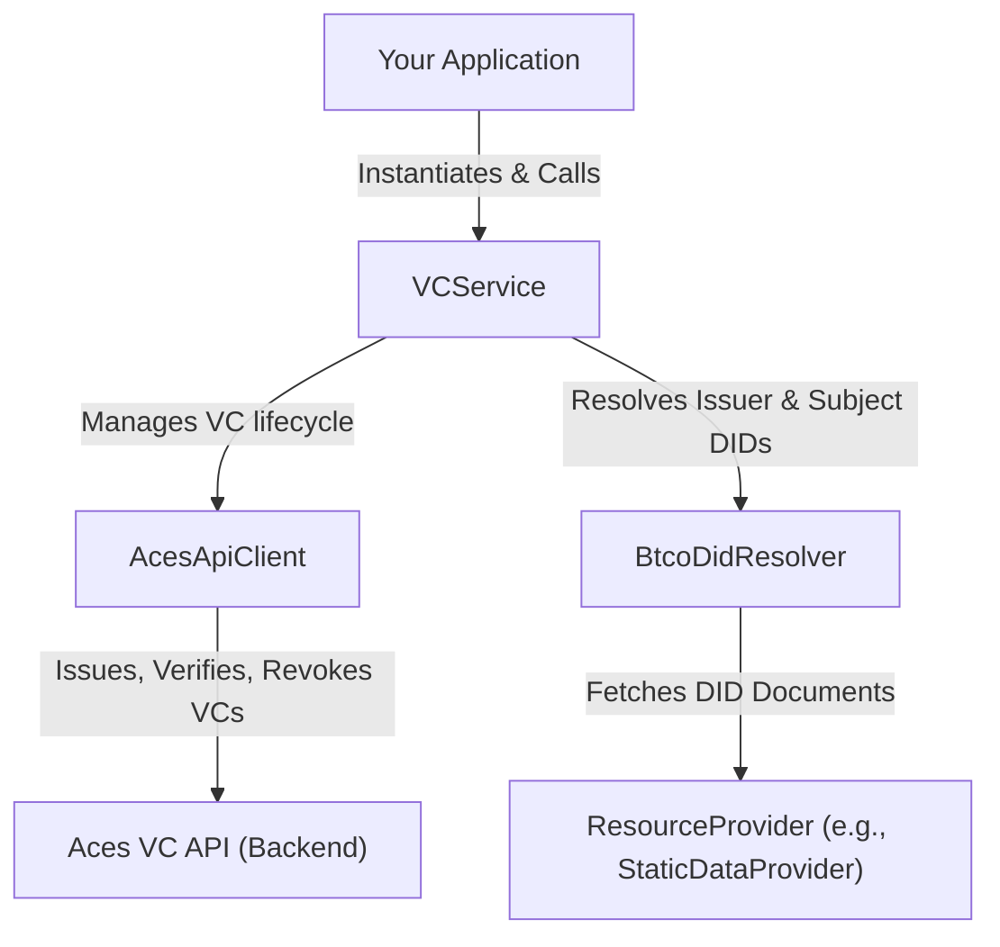

# Verifiable Credentials

This section provides a detailed API reference for the Verifiable Credentials (VC) module. It is designed to help you create, issue, and verify W3C Verifiable Credentials for digital assets like inscriptions. The module centers around the `VCService`, a high-level client that integrates with an external VC API and the BTCO DID resolver.

For a conceptual understanding of how Verifiable Credentials work in this ecosystem, please see the [Verifiable Credentials (VCs)](./core-concepts-verifiable-credentials.md) guide.

### Architecture Overview

The Verifiable Credentials module coordinates several components to deliver its functionality. The `VCService` acts as the primary interface for your application, orchestrating DID resolution and communication with the backend Aces VC API.



## VCService Class

The `VCService` class is the main entry point for managing Verifiable Credentials. It simplifies the process of issuing, verifying, revoking, and checking the status of VCs.

### Constructor

Initializes a new instance of the `VCService`.

```typescript
constructor(config: VCServiceConfig)
```

**Configuration (`VCServiceConfig`)**

| Parameter | Type | Description |
|---|---|---|
| `acesApiUrl` | `string` | Optional. The base URL for the Aces VC API. Required for most operations. |
| `acesApiKey` | `string` | Optional. The API key for authenticating with the Aces VC API. Required for most operations. |
| `platformDid` | `string` | Optional. A platform-wide DID used for certain operations. |
| `resourceProvider` | `ResourceProvider` | Optional. A provider for DID resolution, such as `StaticDataProvider` for pre-fetched data. |
| `defaultProofType` | `ProofType` | Optional. The default proof type to use when issuing credentials. Defaults to `ProofType.DATA_INTEGRITY`. |
| `timeout` | `number` | Optional. Request timeout in milliseconds. Defaults to 30000. |
| `enableRetry` | `boolean` | Optional. Whether to enable request retries on failure. Defaults to `true`. |
| `maxRetries` | `number` | Optional. Maximum number of retry attempts. Defaults to 3. |
| `retryDelay` | `number` | Optional. Delay between retries in milliseconds. Defaults to 1000. |

**Example**

```typescript
import { VCService } from './vc/service';

const vcService = new VCService({
  acesApiUrl: 'https://api.aces.one/vc',
  acesApiKey: 'YOUR_API_KEY',
});
```

### `withStaticData`

A static method to create a `VCService` instance configured with pre-fetched DID data. This is particularly useful in frontend applications or environments where network requests for DID resolution should be avoided.

```typescript
static withStaticData(
  config: Omit<VCServiceConfig, 'resourceProvider'>,
  staticSatData: StaticSatData[]
): VCService
```

**Example**

```typescript
import { VCService } from './vc/service';

// Pre-fetched data for the DIDs you will interact with
const preFetchedData = [
  {
    sat: '12345',
    did: 'did:btco:sig:12345',
    // ... other inscription and sat data
  }
];

const vcService = VCService.withStaticData(
  {
    acesApiUrl: 'https://api.aces.one/vc',
    acesApiKey: 'YOUR_API_KEY',
  },
  preFetchedData
);
```

### Methods

#### `issueCredential`

Issues a new Verifiable Credential for an inscription by preparing the credential data and sending it to the Aces VC API for signing.

```typescript
async issueCredential(params: CredentialIssuanceParams): Promise<VerifiableCredential>
```

**Parameters (`CredentialIssuanceParams`)**

| Parameter | Type | Description |
|---|---|---|
| `subjectDid` | `string` | The DID of the subject (the inscription being credentialized). |
| `issuerDid` | `string` | The DID of the issuer signing the credential. |
| `metadata` | `InscriptionMetadata` | Metadata about the inscription (e.g., title, description). |
| `contentInfo` | `ContentInfo` | Pre-computed technical information about the content, such as hash and MIME type. |

**Example**

```typescript
async function issueNewCredential() {
  try {
    const credential = await vcService.issueCredential({
      subjectDid: 'did:btco:sig:123456789',
      issuerDid: 'did:btco:pk:03abcdef...',
      metadata: {
        title: 'My First Collectible',
        description: 'A unique digital artwork.',
      },
      contentInfo: {
        mimeType: 'image/png',
        hash: 'sha256-abcdef123456...',
        size: 10240, 
      },
    });
    console.log('Credential issued:', JSON.stringify(credential, null, 2));
    return credential;
  } catch (error) {
    console.error('Failed to issue credential:', error);
  }
}
```

#### `verifyCredential`

Verifies the authenticity and integrity of a credential. This process involves local structural validation, cryptographic signature verification using `di-wings`, and an optional secondary check via the Aces VC API.

```typescript
async verifyCredential(credential: VerifiableCredential, satNumber?: string): Promise<boolean>
```

**Parameters**

| Parameter | Type | Description |
|---|---|---|
| `credential` | `VerifiableCredential` | The Verifiable Credential object to verify. |
| `satNumber` | `string` | Optional. The sat number of the inscription being checked. If provided, the service will ensure the credential's subject matches this sat. |

**Example**

```typescript
// Assuming 'signedCredential' is a VC object received from 'issueCredential'
async function verify(signedCredential) {
  try {
    const isValid = await vcService.verifyCredential(signedCredential, '123456789');
    console.log(`Is the credential valid? ${isValid}`); // true or false
  } catch (error) {
    console.error('Verification failed:', error);
  }
}
```

#### `revokeCredential`

Revokes a previously issued credential via the Aces VC API. This action is typically irreversible.

```typescript
async revokeCredential(credentialId: string, issuerDid: string, reason?: string): Promise<boolean>
```

**Parameters**

| Parameter | Type | Description |
|---|---|---|
| `credentialId` | `string` | The ID of the credential to revoke. |
| `issuerDid` | `string` | The DID of the original issuer. |
| `reason` | `string` | Optional. A short reason for the revocation. |

**Example**

```typescript
async function revoke(credId, issuerDid) {
  try {
    const success = await vcService.revokeCredential(credId, issuerDid, 'Item was sold.');
    if (success) {
      console.log(`Credential ${credId} revoked successfully.`);
    } else {
      console.log(`Failed to revoke credential ${credId}.`);
    }
  } catch (error) {
    console.error('Revocation failed:', error);
  }
}
```

#### `checkCredentialStatus`

Checks the current status of a credential (e.g., active, revoked) by querying the Aces VC API.

```typescript
async checkCredentialStatus(credentialId: string): Promise<{ active: boolean; revokedAt?: string; revocationReason?: string; }>
```

**Parameters**

| Parameter | Type | Description |
|---|---|---|
| `credentialId` | `string` | The ID of the credential to check. |

**Example**

```typescript
async function checkStatus(credId) {
  try {
    const status = await vcService.checkCredentialStatus(credId);
    console.log('Credential Status:', status);
  } catch (error) {
    console.error('Failed to check status:', error);
  }
}
```

**Example Response**

```json
{
  "active": false,
  "revokedAt": "2023-10-27T10:00:00Z",
  "revocationReason": "Item was sold."
}
```

#### `createContentInfo`

A helper function to generate a `ContentInfo` object from raw content. It calculates the content hash (SHA-256), size, and attaches other metadata.

```typescript
async createContentInfo(
  content: Buffer,
  mimeType: string,
  dimensions?: { width: number; height: number }
): Promise<ContentInfo>
```

**Example**

```typescript
import fs from 'fs/promises';

async function generateContentInfo(filePath) {
  try {
    const fileBuffer = await fs.readFile(filePath);
    const contentInfo = await vcService.createContentInfo(fileBuffer, 'image/jpeg');
    console.log('Generated Content Info:', contentInfo);
    return contentInfo;
  } catch (error) {
    console.error('Error creating content info:', error);
  }
}
```

## Key Data Types

The module exports a set of TypeScript interfaces and enums that align with the [W3C VC Data Model 2.0](https://www.w3.org/TR/vc-data-model-2.0/).

#### `VerifiableCredential`

The main interface representing a credential.

```typescript
interface VerifiableCredential {
  '@context': string | any | Array<string | any>;
  id?: string;
  type: string | string[];
  issuer: { id: string; [key: string]: any; };
  issuanceDate: string;
  expirationDate?: string;
  credentialSubject: CredentialSubject | CredentialSubject[];
  proof?: CredentialProof | CredentialProof[];
  credentialStatus?: { id: string; type: string; };
}
```

#### `CredentialSubject`

Represents the entity the claims in the credential are about.

```typescript
interface CredentialSubject {
  id: string; // The DID of the subject
  type?: string;
  title?: string;
  description?: string;
  creator?: string;
  creationDate?: string;
  properties?: { [key: string]: any; };
}
```

#### `ContentInfo`

Technical details about the digital content being credentialized.

```typescript
interface ContentInfo {
  mimeType: string;
  hash: string;
  dimensions?: { width: number; height: number; };
  size?: number;
  duration?: number;
}
```

#### `ProofType`

Supported proof types for issuing credentials.

```typescript
enum ProofType {
  JWT = 'jwt',
  DATA_INTEGRITY = 'DataIntegrityProof',
  LD_PROOF = 'LDProof',
}
```

## Utilities

The module also includes utility functions for formatting and validating credentials locally.

- **Formatters (`/vc/formatters.ts`):** Contains functions like `prepareCredentialSubject` and `calculateContentHash` to help construct valid VC objects from raw data.

- **Validators (`/vc/validators.ts`):** Provides `validateCredential` and other functions to perform structural checks on a credential object before it is sent to the API or used in your application.

**Example: Using `validateCredential`**

```typescript
import { validateCredential } from './vc/validators';

const validation = validateCredential(myCredentialObject);

if (!validation.valid) {
  console.error('Credential is not valid:', validation.errors.join(', '));
} else {
  console.log('Credential structure is valid.');
}
```

This concludes the API reference for the Verifiable Credentials module.