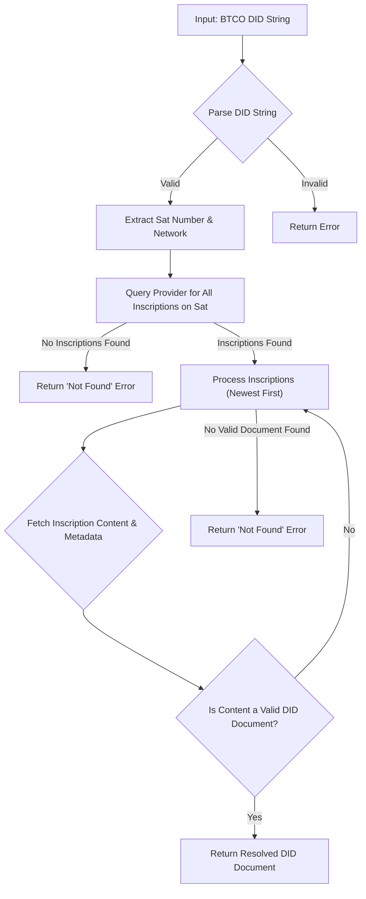

# BTCO DIDs

A BTCO Decentralized Identifier (DID) is a W3C-compliant identifier that is permanently anchored to a specific satoshi on the Bitcoin blockchain. It uses the Ordinals protocol to inscribe data, such as a DID Document, onto the satoshi, establishing a decentralized and self-sovereign identity.

The state of the DID is determined by the history of inscriptions on its associated satoshi. This library provides the tools to create, resolve, and manage these on-chain identities.

## DID Format

A BTCO DID follows a standardized structure that makes it universally recognizable and resolvable. The format is designed to be simple and directly map to its corresponding satoshi.

`did:btco:[network]:<sat-number>`

| Component | Description |
| :--- | :--- |
| `did` | The standard prefix for all W3C DIDs. |
| `btco` | The specific method identifier for Bitcoin Ordinals. |
| `network` | (Optional) The Bitcoin network. Can be `test` for Testnet or `sig` for Signet. If omitted, it defaults to `mainnet`. |
| `sat-number` | The unique serial number of the satoshi that the DID is attached to. |

Here are some examples:

```typescript
// A DID on the Bitcoin mainnet
const mainnetDid = 'did:btco:1908770696977240';

// A DID on the Testnet
const testnetDid = 'did:btco:test:1234567890';
```

## DID Resolution Process

Resolving a DID means retrieving its associated DID Document. The `BtcoDidResolver` class handles this process by querying the Bitcoin blockchain for inscriptions on the specified satoshi.

The resolution process adheres to the BTCO DID Method Specification:

1.  **Parse DID**: The resolver first validates the DID string and extracts the satoshi number and network.
2.  **Find Inscriptions**: It then queries a provider (like Ordiscan or a local Ord node) to find all inscriptions associated with that satoshi.
3.  **Retrieve Content**: The resolver fetches the content and metadata for each inscription.
4.  **Identify DID Document**: It scans the inscriptions, starting from the most recent one, looking for valid DID Document content.
5.  **Return Document**: The first valid DID Document found (from newest to oldest) is returned as the current state of the DID.

This process can be visualized as follows:



Here is how to resolve a DID using the library:

```typescript
import { BtcoDidResolver, ProviderType } from 'ordinalsplus';

// The resolver can be configured with a provider.
// By default, it uses Ordiscan for mainnet and requires an API key.
const resolver = new BtcoDidResolver({
    provider: { 
        type: ProviderType.ORDISCAN, 
        options: { apiKey: 'your-ordiscan-api-key' }
    }
});

const didString = 'did:btco:1908770696977240';

async function resolveDid(did: string) {
  try {
    const result = await resolver.resolve(did);
    if (result.didDocument) {
      console.log('Resolved DID Document:', JSON.stringify(result.didDocument, null, 2));
    } else {
      console.error('Resolution failed:', result.resolutionMetadata.message);
    }
  } catch (error) {
    console.error('An unexpected error occurred:', error);
  }
}

resolveDid(didString);
```

## DID Document Management

The core of a DID is its DID Document, a JSON object that contains cryptographic material, verification methods, and service endpoints. This document is what proves ownership and enables interaction with the DID.

The library includes functions to create and manage W3C-compliant DID Documents before they are inscribed.

### Creating a DID Document

You can generate a new DID Document and its associated cryptographic keys using the `createDidDocument` function. This prepares the content that you will later inscribe on-chain.

```typescript
import { createDidDocument, BitcoinNetwork } from 'ordinalsplus';

async function generateDocument() {
  const satNumber = 1234567890;
  const network: BitcoinNetwork = 'mainnet';

  // This generates the document and the initial key pair
  const { document, publicKey, secretKey } = await createDidDocument(satNumber, network);

  console.log('Generated DID Document:');
  console.log(JSON.stringify(document, null, 2));
}

generateDocument();
```

An example of a minimal DID Document:

```json
{
  "@context": [
    "https://www.w3.org/ns/did/v1",
    "https://w3id.org/security/suites/ed225519-2020/v1"
  ],
  "id": "did:btco:1234567890",
  "verificationMethod": [
    {
      "id": "did:btco:1234567890#key-1",
      "type": "Ed25519VerificationKey2020",
      "controller": "did:btco:1234567890",
      "publicKeyMultibase": "z6Mkt..."
    }
  ],
  "authentication": [
    "did:btco:1234567890#key-1"
  ]
}
```

### Validating a DID String

Before attempting to resolve a DID, it is good practice to validate its format. The library provides a simple utility function for this purpose.

```typescript
import { isValidBtcoDid } from 'ordinalsplus';

const validDid = 'did:btco:1908770696977240';
const invalidDid = 'did:example:1234';

console.log(`Is '${validDid}' valid?`, isValidBtcoDid(validDid)); // true
console.log(`Is '${invalidDid}' valid?`, isValidBtcoDid(invalidDid)); // false
```

---

### Next Steps

Now that you understand how BTCO DIDs are structured and resolved, you can explore how they are used to own and manage other on-chain data.

*   Learn how to associate other inscriptions with a DID in the [Linked Resources](./core-concepts-linked-resources.md) section.
*   For a complete list of functions, classes, and types, see the [DIDs API Reference](./api-reference-dids.md).
