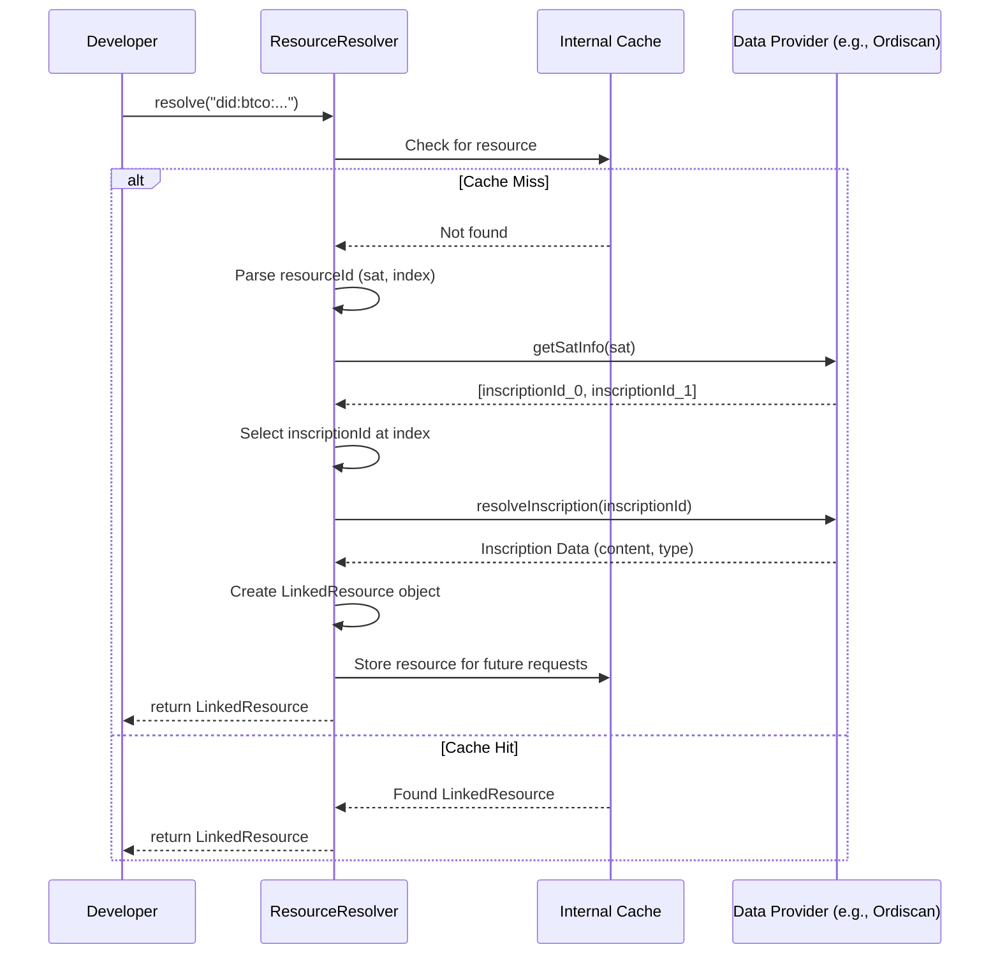

# Linked Resources

A BTCO DID serves as an anchor for on-chain data, known as Linked Resources. These are simply inscriptions on the Bitcoin blockchain that are associated with a specific DID. The `ResourceResolver` class is the primary tool for fetching and interacting with this data from providers like Ordiscan.

## Resource Identifier (ID)

Every resource is identified by a unique string that combines the controlling DID with the resource's index. The format is straightforward:

`did:btco:<sat_number>/<index>`

- **`<sat_number>`**: The satoshi number that forms the basis of the BTCO DID.
- **`<index>`**: A zero-based index specifying which inscription on that satoshi the resource corresponds to. The first inscription is `0`, the second is `1`, and so on.

For example, `did:btco:1908770696991731/0` refers to the first resource inscribed on the satoshi `1908770696991731`.

## Initializing the ResourceResolver

Before you can fetch resources, you need to create an instance of `ResourceResolver`. You can configure it with your API key, the desired network, and caching options.

```typescript
import { ResourceResolver, ProviderType } from 'ordinalsplus';

// Initialize with the Ordiscan provider
const resolver = new ResourceResolver({
    type: ProviderType.ORDISCAN,
    options: {
        apiKey: 'your-ordiscan-api-key', // Recommended to use environment variables
        network: 'mainnet' // or 'signet'
    }
});
```

| Option | Description |
|---|---|
| `type` | The data provider to use. Currently supports `ProviderType.ORDISCAN` and `ProviderType.ORD`. |
| `options.apiKey` | Your API key for the selected provider (e.g., Ordiscan). |
| `options.network` | The Bitcoin network to query, either `'mainnet'` or `'signet'`. Defaults to `'mainnet'`. |
| `options.cacheEnabled` | Determines if responses should be cached in memory. Defaults to `true`. |
| `options.cacheTtl` | Cache Time-To-Live in milliseconds. Defaults to 300,000 (5 minutes). |

## Resolving a Single Resource

The `resolve()` method fetches the full content and metadata for a specific resource ID. It returns a `LinkedResource` object.

```typescript
async function getResource(resourceId) {
  try {
    const resource = await resolver.resolve(resourceId);

    console.log('Resource Content Type:', resource.contentType);
    console.log('Inscription ID:', resource.inscriptionId);
    console.log('Full resource details:', resource);

    // By default, the resolver caches results. To bypass the cache:
    // const freshResource = await resolver.resolve(resourceId, { noCache: true });

  } catch (error) {
    console.error(`Failed to resolve resource ${resourceId}:`, error);
  }
}

getResource('did:btco:1908770696991731/0');
```

**Example Response (`LinkedResource`)**

```json
{
  "id": "did:btco:1908770696991731/0",
  "type": "application/json",
  "inscriptionId": "d2817202e77551b34250453bd8293952796e953181b674b94b4737a89154f652i0",
  "didReference": "did:btco:1908770696991731",
  "contentType": "application/json",
  "content_url": "https://ordiscan.com/inscription/d2817202e77551b34250453bd8293952796e953181b674b94b4737a89154f652i0",
  "sat": "1908770696991731"
}
```

## Fetching Resource Metadata

If you only need metadata about a resource (like its content type and inscription ID) without fetching its content, use the `resolveInfo()` method. This is more efficient for listing resources or checking for existence.

```typescript
async function getResourceInfo(resourceId) {
  try {
    const info = await resolver.resolveInfo(resourceId);
    console.log('Resource Info:', info);
  } catch (error) {
    console.error(`Failed to resolve info for ${resourceId}:`, error);
  }
}

getResourceInfo('did:btco:1908770696991731/0');
```

**Example Response (`ResourceInfo`)**

```json
{
  "id": "did:btco:1908770696991731/0",
  "type": "application/json",
  "contentType": "application/json",
  "createdAt": "2023-10-27T10:00:00.000Z",
  "updatedAt": "2023-10-27T10:00:00.000Z",
  "content_url": "https://ordiscan.com/inscription/d28172...",
  "inscriptionId": "d2817202e77551b34250453bd8293952796e953181b674b94b4737a89154f652i0",
  "didReference": "did:btco:1908770696991731",
  "sat": "1908770696991731"
}
```

## Resolving a Resource Collection

To retrieve all resources associated with a single DID, use the `resolveCollection()` method. This is useful for discovering all data linked to an identity.

```typescript
async function getCollection(did) {
  try {
    const resources = await resolver.resolveCollection(did, {
      limit: 10, // Optional: limit the number of results
      offset: 0  // Optional: for pagination
    });

    console.log(`Found ${resources.length} resources for DID ${did}:`);
    resources.forEach(res => {
      console.log(`- ID: ${res.id}, Type: ${res.contentType}`);
    });

  } catch (error) {
    console.error(`Failed to resolve collection for ${did}:`, error);
  }
}

getCollection('did:btco:1908770696977240');
```

The method returns an array of `LinkedResource` objects.

## Resolution Flow

The process of resolving a resource involves several steps, from checking the local cache to fetching data from an external provider.



---

Understanding how to resolve resources is key to reading data from the BTCO DID ecosystem. To learn how this data is created and written to the blockchain, continue to the [Transaction Lifecycle](./core-concepts-transaction-lifecycle.md) guide.