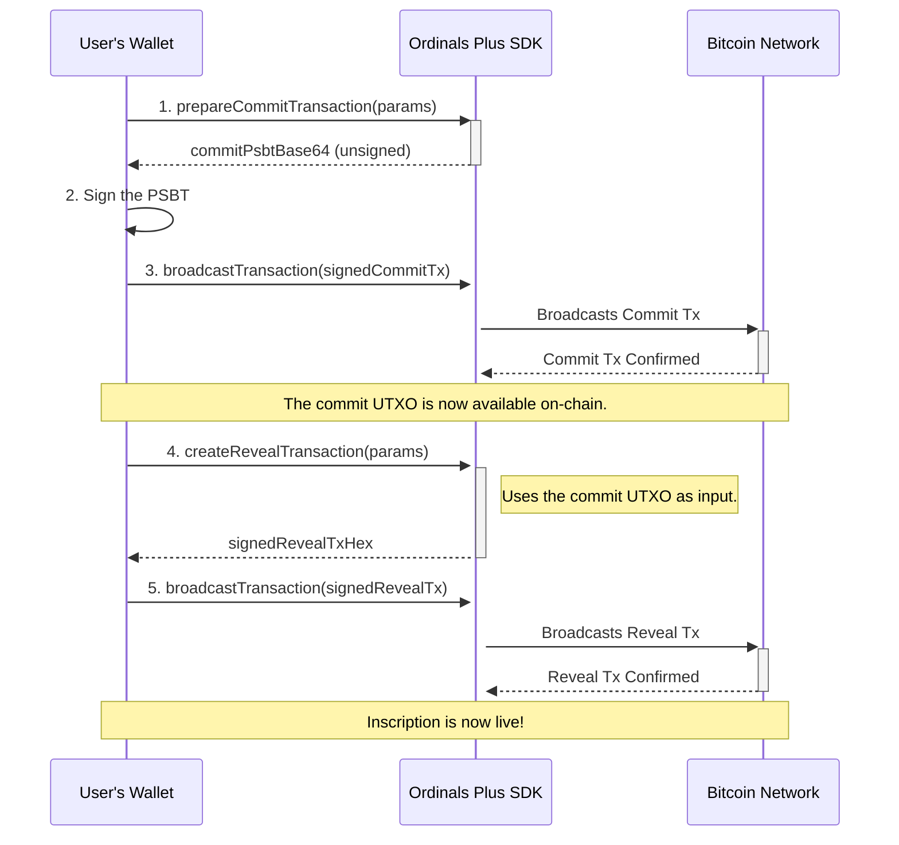

# Transaction Lifecycle

Creating an inscription on the Bitcoin blockchain is not a single-step process. This library uses a standard two-phase **commit/reveal** scheme to ensure inscriptions are created reliably. This process involves two separate transactions: a "commit" transaction followed by a "reveal" transaction.

This section explains the entire lifecycle, from calculating fees and selecting inputs to tracking the final confirmation of your inscription.



## Phase 1: The Commit Transaction

The purpose of the **commit transaction** is to create a specific Taproot UTXO (Unspent Transaction Output) on the blockchain. This UTXO is specially crafted so that it can be spent by the reveal transaction, which will contain the inscription data in its witness. This step essentially reserves a spot for the inscription.

The main function for this phase is `prepareCommitTransaction`.

### `prepareCommitTransaction(params)`

This function prepares the Partially Signed Bitcoin Transaction (PSBT) for the commit phase. It selects UTXOs for funding, calculates the necessary fees, and constructs the transaction outputs.

**Key Parameters**

| Parameter | Type | Description |
|---|---|---|
| `inscription` | `PreparedInscription` | Contains the generated commit address and script details. |
| `utxos` | `Utxo[]` | An array of available UTXOs from the user's wallet to fund the transaction. |
| `changeAddress` | `string` | The Bitcoin address where any remaining funds (change) will be sent. |
| `feeRate` | `number` | The desired fee rate in satoshis per virtual byte (sats/vB). |
| `network` | `BitcoinNetwork` | The target Bitcoin network (e.g., 'mainnet', 'testnet'). |
| `selectedInscriptionUtxo` | `Utxo` | (Optional) A specific UTXO the user wants to use for the inscription. This will always be the first input. |

**Example Usage**

```javascript
import { prepareCommitTransaction } from './transactions';

async function createCommitTx(preparedInscription, myUtxos, myChangeAddress) {
  const params = {
    inscription: preparedInscription,
    utxos: myUtxos,
    changeAddress: myChangeAddress,
    feeRate: 15, // sats/vB
    network: 'mainnet',
  };

  const result = await prepareCommitTransaction(params);

  console.log('Commit Address:', result.commitAddress);
  console.log('Required Commit Amount (sats):', result.requiredCommitAmount);
  console.log('PSBT to be signed (Base64):', result.commitPsbtBase64);

  // The wallet must now sign `result.commitPsbtBase64`
  // and broadcast the resulting transaction.
  return result;
}
```

After this transaction is broadcast and confirmed on the blockchain, the UTXO sent to the `commitAddress` is ready to be used in the reveal phase.

## Phase 2: The Reveal Transaction

The **reveal transaction** spends the UTXO created by the commit transaction. The magic happens here: the actual content of the inscription (e.g., an image, text, or DID data) is included in the witness data of this transaction's input. When this transaction is confirmed, the inscription is permanently recorded on the blockchain.

The main function for this phase is `createRevealTransaction`.

### `createRevealTransaction(params)`

This function builds and signs the final reveal transaction. It takes the UTXO from the confirmed commit transaction as its primary input.

**Key Parameters**

| Parameter | Type | Description |
|---|---|---|
| `selectedUTXO` | `Utxo` | The UTXO created by the commit transaction. This is the first input. |
| `preparedInscription` | `PreparedInscription` | The same inscription data object used in the commit phase. |
| `feeRate` | `number` | The fee rate in sats/vB for the reveal transaction. |
| `network` | `btc.NETWORK` | The scure/btc-signer network object. |
| `privateKey` | `Uint8Array` | The private key needed to sign the transaction. |
| `destinationAddress`| `string` | (Optional) The address to send the inscribed ordinal to. Defaults to the commit address. |

**Example Usage**

```javascript
import { createRevealTransaction } from './transactions';

// Assume 'commitTxOutput' is the UTXO from the confirmed commit transaction
// and 'privateKey' is the key corresponding to the inscription scripts.
async function createRevealTx(commitTxOutput, preparedInscription, privateKey) {
  const params = {
    selectedUTXO: commitTxOutput,
    preparedInscription: preparedInscription,
    feeRate: 15, // sats/vB
    network: btc.NETWORK.mainnet,
    privateKey: privateKey,
    destinationAddress: 'bc1p...your-destination-address'
  };

  const result = await createRevealTransaction(params);

  console.log('Reveal Transaction Fee (sats):', result.fee);
  console.log('Transaction Hex (to broadcast):', result.hex);

  // The `result.hex` can now be broadcast to the Bitcoin network.
  return result;
}
```

## Supporting Components

Several utilities support the transaction lifecycle.

### Fee Calculation

Correctly calculating fees is critical for ensuring your transactions are mined in a timely manner. The library provides a simple utility for this.

- **`calculateFee(vbytes, feeRate)`**: This function takes the virtual size of a transaction and the desired fee rate (sats/vB) and returns the total fee in satoshis. It also ensures the fee is above the minimum required for network relay.

### UTXO Selection

Transactions are funded by UTXOs. The library automates the process of selecting which UTXOs to use.

- **`selectUtxos(utxos, options)`**: This function implements a simple algorithm to select a set of UTXOs that meets a target amount needed to cover outputs and fees. The `prepareCommitTransaction` function uses this internally. You can also force the use of a specific UTXO for an inscription, and the function will select additional UTXOs if more funds are needed.

### Transaction Tracking

Since the process involves two transactions that must be confirmed, tracking their status is essential. The library includes a built-in tracker.

- **`transactionTracker`**: This is a singleton instance of the `TransactionStatusTracker` class. Both `prepareCommitTransaction` and `createRevealTransaction` automatically create an entry in this tracker. You can subscribe to events or query the status of any transaction by its ID.

**Transaction Statuses**

| Status | Description |
|---|---|
| `PENDING` | The transaction has been prepared but not yet broadcast. |
| `CONFIRMING` | The transaction has been broadcast and is waiting for confirmations. |
| `CONFIRMED` | The transaction has received enough confirmations (typically 6+). |
| `FAILED` | The transaction failed during creation, signing, or broadcasting. |

**Example: Checking Status**

```javascript
import { transactionTracker, TransactionStatus } from './transactions';

// Get the transaction ID from the result of prepareCommitTransaction
const txId = commitResult.transactionId;

// Listen for status changes
transactionTracker.on('statusChanged', ({ id, newStatus }) => {
  if (id === txId) {
    console.log(`Transaction ${id} status is now: ${newStatus}`);
  }
});

// Or get the current status directly
const currentTx = transactionTracker.getTransaction(txId);
if (currentTx && currentTx.status === TransactionStatus.CONFIRMED) {
  console.log('Commit transaction is confirmed!');
}
```

This two-phase lifecycle provides a robust method for creating inscriptions. For more technical details on each function, please see the [Transactions API Reference](./api-reference-transactions.md).
