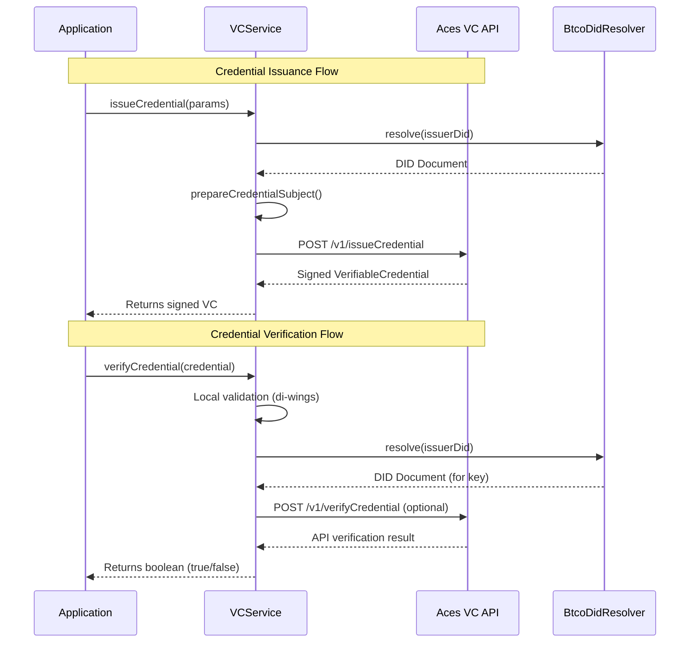

# Verifiable Credentials (VCs)

Verifiable Credentials (VCs) provide a standardized way to make verifiable claims about a subject, in this case, a Bitcoin inscription. The Ordinals Plus library uses the W3C Verifiable Credentials Data Model to enable issuing, verifying, and managing credentials for digital collectibles, linking cryptographic proof to the on-chain asset.

This functionality is managed through the `VCService`, a high-level service that integrates with an external Aces VC API for signing and status management. For more background on the standard itself, see the [W3C VC Data Model 2.0 specification](https://www.w3.org/TR/vc-data-model-2.0/).

### How It Works

The `VCService` orchestrates the entire lifecycle of a credential. It formats inscription metadata, resolves issuer Decentralized Identifiers (DIDs), communicates with the VC API, and performs cryptographic verification.

Here is a diagram showing the typical interaction flows for issuing and verifying a credential:



## Setting up the VCService

To begin, you must instantiate the `VCService` with the necessary configuration to connect to the Aces VC API. This is done through the `VCServiceConfig` object.

### Configuration Options

| Parameter          | Type             | Description                                                                 |
|--------------------|------------------|-----------------------------------------------------------------------------|
| `acesApiUrl`       | `string`         | The base URL for the Aces VC API. Required for most operations.             |
| `acesApiKey`       | `string`         | The API key for authenticating with the Aces VC API. Required.              |
| `platformDid`      | `string`         | An optional platform-wide DID used for certain operations.                    |
| `resourceProvider` | `ResourceProvider` | Optional provider for DID resolution, useful for caching or static data.    |
| `defaultProofType` | `ProofType`      | The default proof type to use when issuing credentials. Defaults to `DATA_INTEGRITY`. |
| `timeout`          | `number`         | Request timeout in milliseconds. Defaults to 30000.                         |
| `enableRetry`      | `boolean`        | Enables automatic retries for failed API requests. Defaults to `true`.        |
| `maxRetries`       | `number`         | The maximum number of retry attempts. Defaults to 3.                        |
| `retryDelay`       | `number`         | The delay between retries in milliseconds. Defaults to 1000.                |

### Basic Initialization

```typescript
import { VCService, ProofType } from '@ordinals-plus/core';

const vcService = new VCService({
  acesApiUrl: 'https://api.aces.one/vc',
  acesApiKey: 'YOUR_API_KEY_HERE',
  defaultProofType: ProofType.DATA_INTEGRITY
});
```

### Initializing with Static Data

For environments where you have pre-fetched DID and inscription data (like a frontend application), you can use the `withStaticData` factory method. This avoids live network calls for DID resolution during verification.

```typescript
import { VCService, StaticSatData } from '@ordinals-plus/core';

// Assume staticSatData is an array of pre-fetched inscription and DID info
const staticSatData: StaticSatData[] = [
  {
    sat: '123456789',
    did: 'did:btco:sig:123456789',
    // ... other pre-fetched data
  }
];

const vcService = VCService.withStaticData(
  {
    acesApiUrl: 'https://api.aces.one/vc',
    acesApiKey: 'YOUR_API_KEY_HERE',
  },
  staticSatData
);

// You can also add more static data to an existing instance
vcService.addStaticData(moreData);
```

## Issuing a Credential

The `issueCredential` method takes details about an inscription and its content, formats them into a W3C-compliant structure, and sends it to the Aces API to be cryptographically signed.

### Parameters

| Parameter      | Type                | Description                                                          |
|----------------|---------------------|----------------------------------------------------------------------|
| `subjectDid`   | `string`            | The DID of the inscription the credential is about.                  |
| `issuerDid`    | `string`            | The DID of the entity issuing the credential.                        |
| `metadata`     | `InscriptionMetadata` | Metadata associated with the inscription (e.g., title, creator).     |
| `contentInfo`  | `ContentInfo`       | Technical details about the content (MIME type, hash, size, etc.). |

### Example

```typescript
import { VCService, InscriptionMetadata, ContentInfo } from '@ordinals-plus/core';

async function issueNewCredential() {
  const vcService = new VCService({ /* config */ });

  const metadata: InscriptionMetadata = {
    title: 'My Digital Artwork',
    description: 'A unique piece of digital art created in 2024.',
    creator: 'did:btco:pk:1...', // Creator's DID
  };

  const contentInfo: ContentInfo = {
    mimeType: 'image/png',
    hash: 'a1b2c3d4e5f6...', // SHA-256 hash of the content
    size: 102400, // Size in bytes
    dimensions: { width: 800, height: 600 },
  };

  try {
    const issuedCredential = await vcService.issueCredential({
      subjectDid: 'did:btco:sig:987654321', // Inscription's DID
      issuerDid: 'did:btco:pk:123456...',    // Issuer's DID
      metadata: metadata,
      contentInfo: contentInfo,
    });

    console.log('Credential Issued:', JSON.stringify(issuedCredential, null, 2));
  } catch (error) {
    console.error('Failed to issue credential:', error);
  }
}
```

An example of a successful response would be a `VerifiableCredential` object containing a `proof` block.

## Verifying a Credential

The `verifyCredential` method checks the integrity and authenticity of a credential. It performs two main checks:
1.  **Local Cryptographic Verification**: It uses the issuer's DID to find their public key and verifies the credential's digital signature locally using `di-wings`.
2.  **API Verification**: As an additional layer, it can call the Aces API to perform its own verification checks.

### Example

```typescript
import { VCService, VerifiableCredential } from '@ordinals-plus/core';

async function verifyExistingCredential(credential: VerifiableCredential) {
  // Use withStaticData for frontend verification to avoid network lookups
  const vcService = VCService.withStaticData({ /* config */ }, [ /* static data */ ]);

  try {
    // Optionally, verify that the credential is for a specific sat number
    const satNumberToVerify = '987654321';

    const isValid = await vcService.verifyCredential(credential, satNumberToVerify);

    if (isValid) {
      console.log('Credential verification successful!');
    } else {
      console.log('Credential verification failed.');
    }
  } catch (error) {
    console.error('An error occurred during verification:', error);
  }
}
```

## Managing Credential Status

Beyond issuance and verification, the `VCService` provides methods to manage the credential's lifecycle.

-   **`checkCredentialStatus(credentialId)`**: Checks if a credential is still active or if it has been revoked. It returns an object with an `active` boolean and optional revocation details.
-   **`revokeCredential(credentialId, issuerDid, reason)`**: Revokes a previously issued credential. This action is permanent and requires the issuer's DID.

## Next Steps

This guide covers the core concepts of using the `VCService` to manage Verifiable Credentials for Bitcoin inscriptions. For a detailed breakdown of all available methods, parameters, and related data types, please refer to the [Verifiable Credentials API Reference](./api-reference-verifiable-credentials.md).