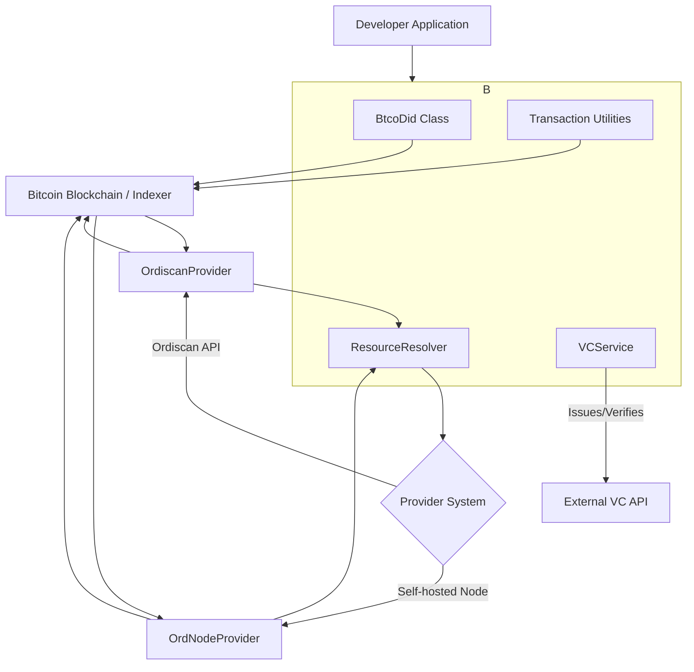

# Core Concepts

To effectively use the Ordinals Plus library, it's helpful to understand the fundamental principles it's built upon. This section provides a high-level overview of the key components and workflows, from decentralized identifiers on Bitcoin to the lifecycle of creating on-chain resources.

The following diagram illustrates the high-level architecture of the library and how its core components interact.

## BTCO DIDs

BTCO is a Decentralized Identifier (DID) method for the Bitcoin blockchain. The Ordinals Plus library provides the `BtcoDid` class to create, parse, and validate these identifiers. Each DID corresponds to a specific satoshi, linking an on-chain identity to a unique Ordinal inscription. This forms the foundation for decentralized identity management within the library.

Learn more about [BTCO DIDs](./core-concepts-btco-dids.md).

## DID Linked Resources

Beyond just identity, DIDs can be associated with structured data called Linked Resources. These are also inscriptions on the Bitcoin blockchain, linked to a parent DID. The `ResourceResolver` class is the primary tool for fetching and interpreting this on-chain data, whether it's a JSON file, an image, or part of a larger collection.

Explore how to work with [Linked Resources](./core-concepts-linked-resources.md).

## Provider System

To access data from the Bitcoin blockchain, the library uses a flexible provider system. The `ResourceResolver` can be configured to use different data sources, such as the public Ordiscan API or a self-hosted Ord node. This design allows you to choose the provider that best fits your application's security, performance, and cost requirements without changing your core logic.

Details on configuring providers are covered in the [Linked Resources](./core-concepts-linked-resources.md) section.

## Transaction Lifecycle

Creating a new DID or Linked Resource involves inscribing data onto a satoshi. This is a two-phase process on Bitcoin: commit and reveal. The library provides a suite of transaction utilities to manage this entire lifecycle, including UTXO selection, fee calculation, transaction signing, and broadcasting. This abstracts away the complexity of Bitcoin's transaction structure.

Understand the full [Transaction Lifecycle](./core-concepts-transaction-lifecycle.md).

## Verifiable Credentials (VCs)

The library integrates with the W3C Verifiable Credentials standard to enable trust and verification for on-chain assets. The `VCService` can be used to issue a credential that attests to the authenticity of an inscription or to verify a credential associated with one. This connects Bitcoin Ordinals to a standardized, interoperable framework for digital trust.

Learn how to issue and verify [Verifiable Credentials](./core-concepts-verifiable-credentials.md).

---

These core concepts work together to provide a comprehensive toolkit for building applications on top of Bitcoin Ordinals. Once you are familiar with these principles, you can explore the detailed [API Reference](./api-reference.md) for specific implementation details.