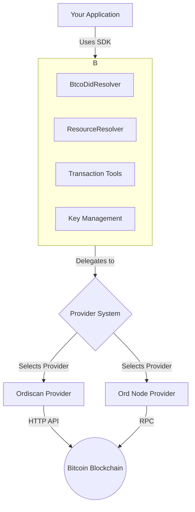

# Overview

Ordinals Plus is a JavaScript/TypeScript library designed for developers working with the Bitcoin blockchain. It provides a comprehensive SDK for managing BTCO Decentralized Identifiers (DIDs) and DID Linked Resources, which are inscribed using the Bitcoin Ordinals protocol.

The library simplifies the process of creating, resolving, and interacting with these on-chain digital identities and their associated data, offering a structured approach to what can otherwise be a complex set of operations.

## How It Works

At its core, Ordinals Plus provides a high-level API that abstracts the complexities of Bitcoin transactions and Ordinals inscription formats. It allows you to work with familiar objects and methods rather than dealing directly with raw transaction data and script construction. The library uses a flexible provider system to fetch data from the Bitcoin network, supporting various indexers like Ordiscan or a direct connection to an Ord node.

## Core Components

The library is organized into several key components, each handling a specific aspect of interacting with BTCO DIDs and resources.

| Component | Description |
|---|---|
| **BtcoDid** | Provides methods for creating, parsing, validating, and resolving BTCO DIDs to their corresponding DID Documents. |
| **ResourceResolver** | Manages DID Linked Resources. It can resolve resource content and metadata, handle collections, and work with heritage relationships (parent/child). |
| **Provider System** | A flexible system for connecting to the Bitcoin blockchain. It includes an abstract interface and supports multiple implementations like Ordiscan and Ord nodes, with a factory for easy creation. |
| **Transaction Management** | A suite of functions for building and broadcasting the two-phase commit/reveal transactions required to create inscriptions on the Bitcoin network. |
| **Key Management** | Handles the generation and management of cryptographic keys (Ed25519, secp256k1, Schnorr) required for signing transactions and DID documents. |
| **Utility Functions** | A collection of helper functions for validation, parsing, API requests, CBOR encoding/decoding, and handling errors. |

Ready to start building? Head over to the [Getting Started](./getting-started.md) guide to install the library and inscribe your first resource.