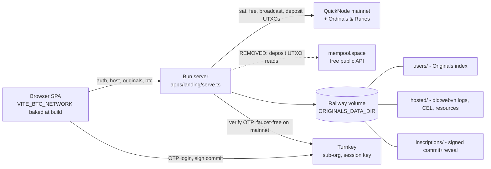
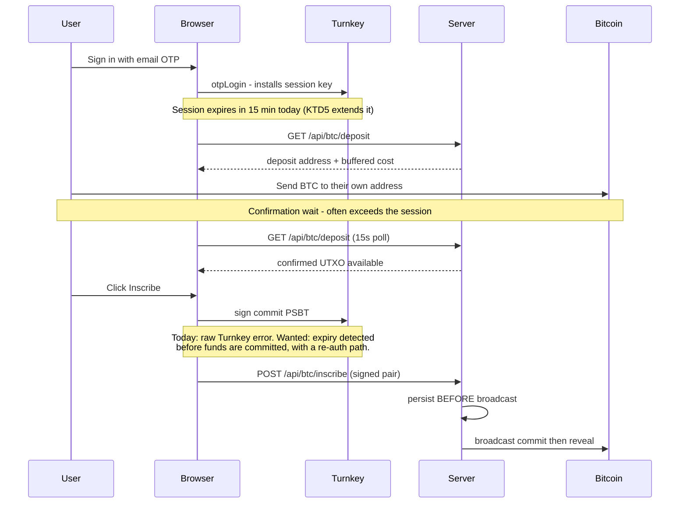
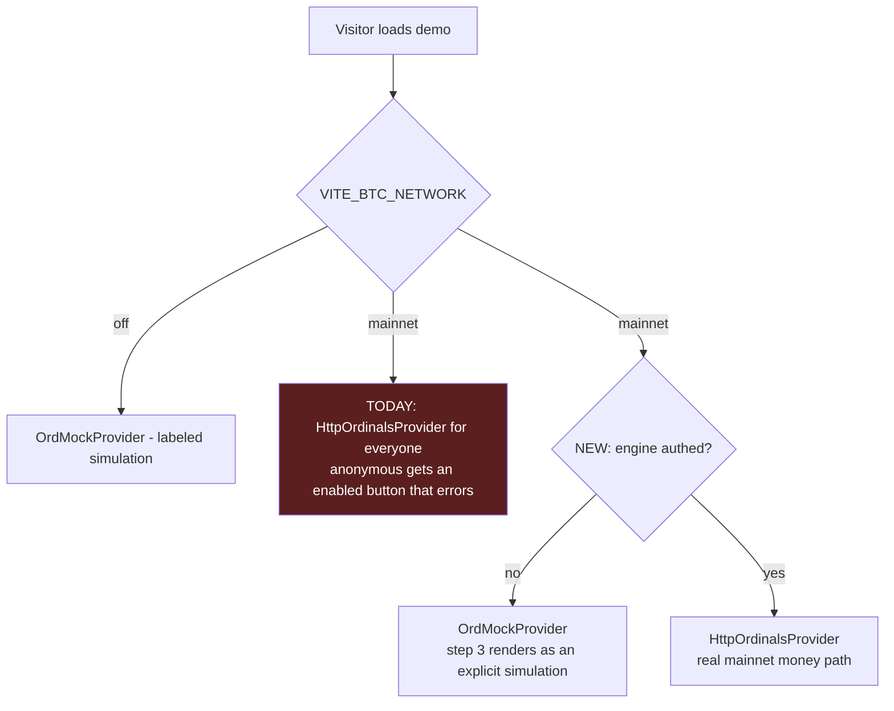

# Originals Landing MVP Launch - Plan

## Goal Capsule

- **Objective:** A stranger who finds `originals.build` can create a real Original, publish it to a resolvable did:webvh, and inscribe it on Bitcoin mainnet with their own funds — and never be misled about what is real, what is simulated, or what they can lose.
- **Means:** Close the correctness, honesty, and configuration gaps on the already-deployed app rather than building new product surface (KTD1).
- **Authority:** Requirements (R-IDs) win on product behavior. KTDs win on mechanism. Units override neither.
- **Execution profile:** The app is live and serving users now. Every unit ships to production incrementally; none of them depends on a big-bang cutover.
- **Stop conditions:** Stop and ask before changing the production domain, before changing anything that alters an already-minted user's did:webvh, before persisting any credential that can sign a mainnet Bitcoin transaction in browser-readable storage (U1), and before enabling `BTC_NETWORK=mainnet` in the deployed environment (the Phase A gate owns that switch).
- **Tail ownership:** Standalone `ce-work` owns commit/push/PR per unit.

---

## Product Contract

### Summary

Make the live `originals.build` deployment safe and honest for public traffic, then turn on mainnet Bitcoin. The work is four bands: fix the flows that cannot currently complete (Turnkey session lifetime, fee-source disagreement, deposit UTXO source), make the two tiers tell the truth (auth-driven simulation, mainnet-accurate copy), harden the production configuration (fail-fast env contract, one rate-limit identity, durable sessions and store capacity, the real domain), and give strangers the trust surface they need (key-loss warning and export, privacy policy and terms, no false loading states).

### Problem Frame

The landing app is already deployed and serving signed-in users at `originals.build`, but it was built as a demo and documented as a static site. Three gaps make public traffic unsafe rather than merely rough.

The signed-in mainnet inscription flow cannot complete. The Turnkey signing session defaults to 15 minutes (`apps/landing/src/auth/turnkey-session.ts`), while the flow requires the user to deposit BTC and wait for a confirmation — typically longer than that. A page reload loses the signing session entirely, because `fetchMe()` restores the user but never re-establishes the Turnkey session (`apps/landing/src/auth/useAuth.tsx`).

The page's claims about itself are wrong in the direction that costs users money. `demo.subhead` states Bitcoin steps use a mock provider, and step 3's description says real inscription arrives "once testnet4 ordinals support ships" — both rendered unconditionally, directly above what becomes a live mainnet money button. `IdentityPanel` tells signed-in users their identity is "live" and "resolvable anywhere DIDs are" for a DID that exists only in `localStorage` at a domain the app does not serve.

The production configuration degrades silently instead of failing. Missing `JWT_SECRET` or `TURNKEY_*` unmounts the entire auth surface with a console log; a `JWT_SECRET` under 32 characters makes every login fail with a generic message; a missing `ORIGINALS_DATA_DIR` volume writes users' Originals and the only copies of signed reveal transactions to an ephemeral container path; and a build-time `VITE_BTC_NETWORK` that disagrees with the runtime `BTC_NETWORK` is invisible in one direction.

### Key Decisions

- **Landing-first scope.** The hosted site is the MVP; SDK work happens only where the site's path is broken. *(session-settled: user-directed — chosen over a general-purpose 3.0 SDK release: the site is what a real user touches.)* Governs R1–R31.
- **Bitcoin is live at launch on mainnet, creator-pays.** PR #491's shape is treated as landed work and is not re-planned. *(session-settled: user-directed — chosen over a "coming soon" gate and over testnet4: the user wants real Bitcoin at launch.)* Governs R1, R2, R3, R4.
- **Two tiers, with the simulated one unmistakably labeled.** The anonymous demo stays; its simulated parts read as fake at a glance. *(session-settled: user-directed — chosen over a login-first site: the demo is the page's proof of life.)* Governs R6, R7, R8.
- **No service fee at launch.** Ship creator-pays with no platform cut. *(session-settled: user-directed — chosen over building the fee now or plumbing it at zero: keeps the money path smaller for a first launch.)* Governs R25.
- **Minimal ops floor.** "Deploy and watch" — no alerting stack, no dashboards, solo on-call, accepted risk. *(session-settled: user-directed — chosen over a real-money reliability floor and over an invite-gated soft launch.)* Governs R21, R22, R29, R30, R31.
- **Developer section softened, not fixed by a release.** No 3.0.0 stable cut in this plan. *(session-settled: user-directed — chosen over cutting 3.0.0 stable at launch: the site is a product, not a package pitch.)* Governs R24.

### Requirements

**Flows that must complete**

- R1. A signed-in user can complete a mainnet inscription across a Bitcoin confirmation wait without re-authenticating mid-flow.
- R2. Reloading the page while signed in restores the ability to sign, or states plainly that re-authentication is needed before the user commits funds.
- R3. The deposit estimate and the inscription use the same fee source, and both refuse to proceed when that source is unavailable.
- R4. Deposit UTXO reads come from the project's paid QuickNode endpoint, not a free public API.

**Funds a stranger deposits**

- R26. A user who deposits in more than one payment, or tops up after a fee rise, can still fund an inscription.
- R27. Before depositing, a user is told what can and cannot be done with a balance that is never spent on an inscription.
- R28. Exhausted provider quota is a disclosed state, not a failed call: no deposit address is offered when the remaining budget cannot fund the inscription that would follow, and a user who already holds a confirmed deposit is told what happens next.
- R31. A user whose funds are stuck is reachable after they close the tab. Quota exhaustion and a wedged inscription are asynchronous server-side events; an in-app message on a page nobody is looking at is not disclosure.
- R29. Every money-path state transition emits a structured server log line, including a periodic count of deposit addresses holding an unspent confirmed balance. This is the instrument the "deploy and watch" posture depends on.

**Honesty of the two tiers**

- R5. Whether a visitor gets the real Bitcoin path is decided by their authentication state, not by a build-time flag.
- R6. An anonymous visitor sees the inscribe step as an unmistakable simulation, never as an enabled action that errors. The signal is visual, not only textual — a label is not enough once the step becomes completable.
- R7. An anonymous visitor is told that their published log is temporary before they publish it.
- R8. No copy claims a step is mocked, coming soon, or on testnet4 when that step is live on mainnet.
- R9. No copy claims an artifact is hosted, live, or resolvable when it exists only in browser storage.

**Production configuration**

- R10. The server refuses to start in a deployed environment when a required configuration value is missing or malformed, naming the specific value.
- R11. A disagreement between the build-time browser network and the runtime server network is detected in both directions and blocks real-money actions.
- R12. The unauthenticated auto-run demo route cannot drive a real-network path.
- R13. Rate limiting uses one client-identity policy across every route, and that policy is correct behind the production proxy.
- R14. A redeploy does not sign users out. Already satisfied by the stateless JWT cookie (KTD8) — verify, do not rebuild.
- R15. The anonymous host store degrades under load without breaking the demo for everyone, and never surfaces a raw transport error to a visitor.
- R16. The production URL constant matches the domain the app is actually served from, and share cards resolve.

**Trust surface**

- R17. A user is warned, before they can lose it, that their authorship key lives in this browser only.
- R18. A user can export their authorship key and restore it in another browser.
- R19. The site publishes a privacy policy and terms covering email collection, cookies, and the non-custodial Bitcoin flow.
- R20. No signed-in user sees a signed-out or empty state while their own data is still loading.

**Deploy contract**

- R21. `apps/landing/DEPLOY.md` describes the deployment that actually exists, including the volume, the environment contract, and the build-time/runtime split.
- R22. A documented runbook covers a wedged reveal transaction and a stuck pending inscription.
- R23. The Railway volume backing `ORIGINALS_DATA_DIR` is verified mounted and has a scheduled backup.
- R30. A documented abort contract names the conditions for turning the money path back off, the mechanism for doing it, and what a user holding a confirmed unspent deposit is told when it happens.
- R24. The developer section's install command and quickstart resolve against what npm actually serves.
- R25. The deposit and cost-estimate flow does not foreclose adding a platform fee output later.

### Success Criteria

- A person who has never seen the app completes create → publish → inscribe on mainnet, from a cold browser, without help, and without the flow expiring under them.
- A skeptical reader cannot find a claim on the page that is false.
- Killing and redeploying the service does not lose a user's Originals, sign them out, or strand funds.

### Scope Boundaries

**In scope:** the live landing deployment, its server, its copy, its configuration contract, and the SDK-side fee-source fix its path depends on.

**Deferred to follow-up work:**
- Platform service fee on inscriptions (the first follow-up; R25 keeps the path open).
- Cutting `@originals/sdk` 3.0.0 stable and rotating `NPM_TOKEN` (#449).
- Inscribing the "First Light" example on mainnet (#332).
- Repo hygiene before heavy GitHub traffic (#381).
- Server-side or Turnkey-derived authorship-key recovery, beyond U10's export.
- Multi-instance scaling (the Railway volume forces a single instance).

**Outside this product's identity:**
- Client-side analytics of any kind (decided in #335; server-log analysis is the sanctioned path).
- A "recent Originals" feed (#333) — there is no enumerable index, and faking one violates the real-not-canned rule.
- Custody of user funds or keys.

### Dependencies

- PR #491 merged. Every Bitcoin unit assumes its routes, stores, and recovery machinery exist.
- A QuickNode mainnet endpoint with the Ordinals & Runes add-on. Without it `getFirstSatOfOutput` returns `SAT_INDEX_UNAVAILABLE` and mainnet inscription is impossible.
- A Railway volume mounted at `ORIGINALS_DATA_DIR`.
- A Turnkey organization reachable from production, with the December 2025 mandatory `appName` parameter satisfied.

### Open Questions

- **Deferred.** The QuickNode Ordinals & Runes add-on price is not publicly documented; get the number from the dashboard before relying on a cost estimate. Does not block implementation.
- **Deferred to implementation, answerable in an afternoon.** Turnkey's real ceiling on session expiry, and whether a non-extractable key can complete an OTP login at all — the browser currently signs the login challenge in a way a non-extractable key cannot feed, so the re-encoding is part of U1's spike. Phase A's shape branches on both answers, which is why U1's execution note front-loads them.
- **Deferred to implementation.** Whether the currently deployed instance actually carries every value U6 proposes to require. This decides whether U6's throw is a no-op or an outage, and is why U6 lands warn-only first.
- **Deferred.** California's DFAL licensing deadline passed on 2026-07-01 and commentators disagree on whether non-custodial services are covered. This needs a legal read, not an engineering answer. Does not block implementation; does affect whether to invite California users loudly.

### Sources

- PR #491 — mainnet creator-pays inscription, durable commit+reveal recovery. The money path's design and its own stated caveats.
- `apps/landing/GRADING.md` — the craft bar and mechanical floor this work must not regress.
- `apps/landing/README.md` — house rules: copy in `content.ts`, zero external runtime dependencies, real-not-canned, no new dependencies.
- `docs/superpowers/plans/2026-07-16-landing-real-webvh-hosting.md` — the resolver's exact URL contract and the honesty rule.
- `docs/superpowers/plans/2026-07-21-your-originals-page.md` — the durable store's design and the anonymous/durable split.
- Railway volume documentation — single instance, downtime on redeploy, opt-in backups, no published durability SLA.
- mempool.space API terms — rate limits enforced by 429 and bans; enterprise sponsorship or self-hosting are the sanctioned paths to headroom. This is what moves R4 to QuickNode.
- Turnkey authentication docs — 15-minute default session, OTP limits of 3 requests per 3 minutes, mandatory `appName` since 2025-12-16.

---

## Planning Contract

### Key Technical Decisions

- KTD1. **Treat the deployment as live and fix forward.** The app already serves users at `originals.build`; every unit is an incremental production change, not part of a launch cutover. *(session-settled: user-approved — chosen over planning a fresh deploy: the site is already up, and a cutover plan would describe work that does not exist.)*
- KTD2. **Provider selection becomes auth-conditional.** `DemoEngine` picks `OrdMockProvider` versus `HttpOrdinalsProvider` from the engine's `authed` flag combined with the network flag, instead of the network flag alone. Governs R5, R6.
- KTD3. **One fee source for the money path.** The deposit estimate and the inscription both read the same estimator, and the deposit route stops flooring to 1 sat/vB on failure. Fail closed on both sides rather than quoting a number the inscribe path will reject. Governs R3.
- KTD4. **The deposit indexer is a swappable, authenticated config seam — not a specific vendor.** Measured against the live mainnet endpoint: Bitcoin Core has no address index, `scantxoutset` is blocked at QuickNode's edge, no wallet RPC is exposed, and the Ordinals & Runes add-on — which IS enabled and does gate inscription — has no address surface in either direction tested. The only QuickNode address path is a separate paid add-on (Blockbook serves outpoints; Balance Index appears to serve only a balance, which cannot fund a commit). Ship on the free Esplora-shaped API the code already speaks, behind a config seam that takes an auth token and degrades honestly per KTD3, so a paid tier or a self-hosted index is one environment variable rather than a rewrite. *(session-settled: user-directed — chosen over buying Blockbook, buying Balance Index, and leaving the work blocked: the add-on that actually gates inscription is already owned, deposit polling only runs while a creator is awaiting a deposit, and the exposure is an unsanctioned dependency rather than a capacity limit.)* Governs R4.
- KTD5. **Extend the Turnkey session and restore it on load.** Raise `expirationSeconds` to cover a confirmation wait, persist enough state to re-establish the session after a reload, and treat expiry as a first-class UI state checked before the user is asked to commit funds — never as a raw error after they have. The exact ceiling is Turnkey's, read at implementation. Governs R1, R2.
- KTD6. **Boot-time configuration contract.** A single validated config module runs at startup: in a deployed environment a missing or malformed required value throws with the value's name; in local development it warns and degrades as today. This replaces the current pattern of silently unmounting whole route families. Governs R10, R11, R12.
- KTD7. **One client-identity policy, by trusted hop count.** Read `x-forwarded-for` from the right-hand end at a configured hop depth, falling back to the socket peer when the header is absent or too short, through a single helper used by every rate-limited route. Hop count rather than proxy identity because the platform exposes no stable edge address to match against. Today `apps/landing/server/app.ts` uses the socket peer while `auth-routes.ts` and `bitcoin.ts` use the raw header, so auth limits are bypassable and host limits are collective. Governs R13.
- KTD8. **Leave authentication state alone.** The redeploy-logout defect does not exist. Login is a stateless 7-day JWT cookie and `/api/me` only verifies it, so no server-side session is consulted; the in-memory store in `apps/landing/serve.ts` holds pending-OTP state during login, and a redeploy costs an in-flight code the user simply re-requests. A filesystem session store would persist OTP state to disk to fix nothing. Governs R14.
- KTD9. **Copy fixes are copy-first.** Every honesty fix lands in `apps/landing/src/content.ts` with components reading from it, including the component strings currently hardcoded. Governs R7, R8, R9.
- KTD10. **The authorship-key remedy for launch is warn-and-export, not recovery.** A blocking warning plus export/import; server-side or Turnkey-derived key recovery is deferred. Governs R17, R18.

### High-Level Technical Design

**Component topology after this plan.** The dashed edge is the one being removed.

**The flow that cannot complete today.** The signing credential dies inside the confirmation wait.

**Tier selection, before and after.** The gate moves from the build flag to auth state.

### Assumptions

- PR #491 merges before this work starts. If it does not, every Bitcoin unit — U1, U2, U3, U4, U5, U6, U15 — loses the routes, stores, or recovery machinery it modifies, and Phase A cannot proceed.
- The count of durable did:webvh DIDs already minted at the production domain is unknown to this plan, and that count is what turns the domain from a choice into a permanent constraint. Read it off the volume before Phase A starts; if it is small, R16 is a live decision rather than a settled swap.
- Two domains are already in the minted corpus, not one. Asset DIDs are published against the demo host, but user *identity* DIDs are minted against the hardcoded development-tier domain in `apps/landing/src/auth/webvh.ts`. This does not change R16's conclusion, but it means "the domain" is not a single value, and U2 is explicitly scoped away from the identity one.
- `originals.build` is the final production domain. It is already baked into every durable did:webvh minted so far, so changing it later orphans those DIDs — this is why R16 is a swap of the placeholder constant, not a domain decision.
- Turnkey permits a session expiry long enough to cover a Bitcoin confirmation. If its ceiling is shorter than a realistic wait, KTD5's re-authentication path becomes the primary remedy rather than the fallback, and U1's approach changes accordingly.
- The Railway volume is currently mounted. If U6's verification finds it is not, users' Originals have been wiped on past redeploys and that becomes a data-loss disclosure question, not just a config fix.

### Implementation Constraints

These are house rules, not preferences. Sources are in the Product Contract.

- All user-visible copy lives in `apps/landing/src/content.ts`. Components read from it.
- No new dependencies: no router, no database, no component library, no full `playwright`.
- Zero external runtime dependencies in the browser bundle: no CDNs, no third-party JS, no client-side analytics.
- No raw private keys on the server.
- Every `/api/originals*` and `/api/btc/*` route stays auth-gated and rate-limited.
- Fail-closed behavior stays fail-closed: hosted-resource hash verification, CEL signature verification, `FEE_RATE_REQUIRED`, network-skew refusal.
- Bun only. Server tests in `apps/landing/server/tests/`, browser tests in `apps/landing/src/**/*.test.ts`.
- `apps/landing/GRADING.md`'s mechanical floor must still pass: zero console errors at 375px and 1440px through a full demo run, throttled time-to-interactive under 3s.
- Live Bitcoin and Turnkey end-to-end checks are manual smokes, never automated.

### Sequencing

Phases are derived from one question: **what irreversible harm to a stranger becomes possible once mainnet is on?** Not "what stops the flow completing" — that test would leave permanent key loss and a bypassable limit on the money routes outside the gate.

**Phase A — the pre-mainnet gate: U1, U2, U3, U4, U5, U6, U7, U10, U15, U16, plus U13's abort contract and stuck-reveal runbook.** Everything whose absence lets a stranger lose something they cannot get back once real money is flowing: a flow that cannot complete, copy that misdescribes where funds go, a deposit that cannot be spent, an authorship key destroyed by a cleared browser, a spend-adjacent rate limit that a rotated header defeats, or no defined way to turn the money path off. U6's volume-mount verification is inside this gate because the volume holds the only copies of signed reveal transactions.

**Phase B — live-visitor defects: U8, U9, U11, U12.** These harm people visiting the site *today*, before mainnet is enabled, so they run in parallel with Phase A and land as soon as they are ready rather than waiting on it. Broken share cards, raw transport errors, a false "no Originals yet", and email collection with no privacy policy are all live now.

**Phase C — the rest of U13, and U14.** Documentation and the developer surface.

---

## Implementation Units

### Unit Index

All paths are relative to `apps/landing/` unless otherwise shown. Phase A gates mainnet; see Sequencing.

| U-ID | Phase | Title | Primary files | Depends on |
|---|---|---|---|---|
| U1 | A | Turnkey session survives the confirmation wait | `src/auth/turnkey-session.ts`, `src/auth/useAuth.tsx` | — |
| U2 | A | Tier selection follows auth, not the build flag | `src/sdk/engine.ts`, `src/components/Demo.tsx` | — |
| U3 | A | One fee source for deposit estimate and inscribe | `server/bitcoin.ts`, `packages/sdk/src/adapters/providers/QuickNodeProvider.ts` | — |
| U4 | A | Deposit UTXO reads move off the free public API | `server/bitcoin.ts`, `serve.ts` | — |
| U5 | A | Mainnet-honest copy across both tiers | `src/content.ts`, `src/components/*` | U2, U15 |
| U6 | A | Boot-time config contract, volume check, network-skew gate | `serve.ts`, `server/config.ts` (new), `src/App.tsx` | — |
| U16 | A | Multi-input funding: relax the single-input invariant end to end | `packages/sdk/src/bitcoin/inscribe-on-sat.ts`, `packages/sdk/src/lifecycle/LifecycleManager.ts`, `server/inscriptions-store.ts` | — |
| U15 | A | Deposits a stranger can actually spend, and are observable | `src/components/Demo.tsx`, `server/bitcoin.ts`, `server/inscriptions-store.ts` | U3, U4, U16 |
| U7 | A | One client-identity policy for rate limiting | `server/client-ip.ts` (new), `server/app.ts`, `server/auth-routes.ts`, `server/bitcoin.ts` | — |
| U8 | B | Anonymous host store survives a traffic spike | `server/webvh-host.ts`, `src/components/Demo.tsx` | — |
| U9 | B | Production URL swap and share cards | `src/content.ts`, `public/robots.txt`, `public/sitemap.xml` | — |
| U10 | A | Authorship key: warn and export | `src/auth/webvh.ts`, `src/components/IdentityPanel.tsx` | U5 |
| U11 | B | Privacy and terms — descriptive half only | `src/content.ts`, `src/pages/Legal.tsx` (new), `src/router.tsx` | U15 |
| U12 | B | No false loading states | `src/auth/useAuth.tsx`, `src/pages/YourOriginals.tsx`, `src/pages/OriginalDetail.tsx` | — |
| U13 | A/C | Deploy runbook, abort contract, volume backup | `apps/landing/DEPLOY.md`, `/railway.json` | U6 |
| U14 | C | Developer section softened and install line honest | `src/content.ts`, `src/components/Developers.tsx` | U5 |

---

### U1. Turnkey session survives the confirmation wait

**Goal:** A signed-in user can deposit BTC, wait for confirmation, and sign the commit without the signing credential expiring under them — and a reload does not silently strip their ability to sign.

**Requirements:** R1, R2. Implements KTD5.

**Dependencies:** —

**Files:**
- `apps/landing/src/auth/turnkey-session.ts`
- `apps/landing/src/auth/useAuth.tsx`
- `apps/landing/src/auth/api.ts`
- `apps/landing/src/auth/turnkey-browser-client.ts`
- `apps/landing/src/components/Demo.tsx`
- `apps/landing/src/content.ts`
- `apps/landing/src/auth/turnkey-session.test.ts`

The last two auth files are here because the non-extractable path reaches further than it looks: the P-256 keypair is generated in `api.ts` and its public half is sent to `verify-otp`, which binds the returned verification token — so a non-extractable key must be created *before* OTP verification. And the browser client builds its stamper from a raw private key, which must be swapped for a handle-based one. Understating this is what would quietly make the XSS-stealable fallback the cheaper option.

**Approach:**
1. Raise the session `expirationSeconds` from the 15-minute default to Turnkey's practical ceiling for this flow, read from Turnkey's current documentation at implementation time rather than assumed here.
2. Restore signing capability on load, so `fetchMe()` restoring the user also restores `bitcoin`. Re-running `OTP_LOGIN` is not available — the verification token is single-use — so this forces a credential-storage choice that must be made deliberately rather than discovered mid-implementation: persist the raw P-256 private key (simple, but an XSS-stealable credential that signs mainnet Bitcoin transactions), or adopt Turnkey's non-extractable-key stamper so the key cannot be read out of the browser. Prefer the non-extractable option and fall back only with a recorded reason. Either way the key never goes to the server.
3. Expose session validity as UI state. Check it before the deposit screen offers an address, and again before signing — never let expiry surface as a raw Turnkey error after the user has sent funds.
4. When the session has expired, present re-authentication as an explicit step with copy from `content.ts`, and preserve the in-flight Original so the user does not restart.
5. Do not let re-authentication trip the existing reset. `Demo.tsx` has an effect keyed on the auth identity that discards the engine and clears the asset whenever `isAuthenticated` or the sub-org id changes. If re-authentication runs as a full sign-out-and-OTP cycle, that effect fires and destroys the exact in-flight Original this unit promises to preserve — after the user has already sent BTC. Either re-authentication must refresh the signing session without toggling the auth identity, or the reset effect must learn to distinguish a session refresh from a genuine identity change. Settle this in the same spike as the credential question; the two answers are coupled.
6. Make sign-out actually end signing capability. Today `signOut()` clears React state and calls logout; it never erases the installed credential or revokes it at Turnkey. Lengthening the session and persisting it across reloads turns that into a durable, still-valid mainnet signing credential left on a shared or borrowed browser while the UI says signed out. Sign-out must erase the persisted credential (or key handle) from browser storage and attempt revocation; a failed revocation still erases locally and surfaces as a named state.

**Execution note:** Answer the credential question before any other Phase A unit lands. Spike Turnkey's non-extractable stamper against a simulated confirmation-length wait and read the real session ceiling off Turnkey's current documentation — both are an afternoon's work, and Phase A's shape branches on the answer. Committing to a sequencing plan and discovering the answer afterwards makes the fallback the default by accident. The reload hole and the expiry hole are then separate defects with separate tests; prove each with a failing test before fixing. The Goal Capsule's stop condition on browser-readable signing credentials applies here: this choice is not the implementer's to make alone.

**Patterns to follow:** `apps/landing/src/auth/useAuth.tsx`'s existing `verify()` bootstrap is the shape the reload path must reproduce. Error-state copy follows the `demo.deposit.*` entries in `content.ts`.

**Test scenarios:**
- A session created with the extended expiry reports valid after a simulated interval longer than 15 minutes.
- `fetchMe()` on a fresh page load with a valid auth cookie yields an authenticated user whose signing capability is present, not `isAuthenticated && !bitcoin`.
- A session past its expiry is reported invalid by the pre-deposit check, and the deposit address is not shown.
- A session that expires between the deposit screen and the inscribe click is caught by the pre-sign check, and the user sees the re-authentication state rather than a raw error string.
- After re-authentication, the in-flight Original is still present and inscribable, including when re-authentication runs as a full sign-out-and-relogin cycle.
- Signing with a valid session is unaffected by the new checks.
- After sign-out, no signing credential remains in browser storage.
- After sign-out and a reload, the inscribe path reports re-authentication needed rather than signing.

**Verification:** From a cold browser, sign in, reload the page, and confirm the inscribe path is available without signing in again. Then let a session lapse and confirm the failure is a named, actionable state.

---

### U2. Tier selection follows auth, not the build flag

**Goal:** On a mainnet build, an anonymous visitor gets the labeled simulation and a signed-in user gets the real path — decided by authentication state.

**Requirements:** R5, R6. Implements KTD2.

**Dependencies:** —

**Files:**
- `apps/landing/src/sdk/engine.ts`
- `apps/landing/src/components/Demo.tsx`
- `apps/landing/src/sdk/engine-identity.test.ts`
- `apps/landing/src/sdk/network-flag.test.ts`

**Approach:**
1. In `DemoEngine`'s constructor, combine the network flag with the engine's `authed` flag when choosing the ordinals provider, so an unauthenticated engine keeps `OrdMockProvider` on any network.
2. Correct the SDK `network` value passed for an unauthenticated engine so the mock path is internally consistent, and correct the hardcoded development-tier `webvhNetwork` in `apps/landing/src/sdk/engine.ts` to the tier matching the deployed network. This is a consistency cleanup, not a behavior fix: the publisher DID's domain comes from the explicit demo host, not from the tier.
3. In `Demo.tsx`, drive the step-3 rendering from the same auth-aware signal, so the "simulation" presentation and the enabled money button can never both be wrong.
4. Design a distinct visual treatment for the simulated tier, and treat this as load-bearing rather than cosmetic. Today the *only* at-a-glance signal that step 3 is not real is that the button is disabled and reads "Coming soon" — greyed, not-allowed cursor, unclickable. Making the anonymous tier completable removes that signal, and copy alone then separates "fake" from "a stranger's real Bitcoin" for a skimming visitor. The simulated tier needs a treatment that survives skimming — the existing layer-badge and token vocabulary in `apps/landing/src/design/` is the place to draw it from, and it must hold at 375px and under reduced motion.
5. Leave PR #491's UI gate in place; this unit removes the case where the gate and the engine disagree.
6. Scope the correction to `apps/landing/src/sdk/engine.ts` only. The identity DID's own hardcoded domain in `apps/landing/src/auth/webvh.ts` is **not** in scope: changing it would change the DID string of every already-minted user, which the Goal Capsule's stop condition covers.

**Technical design (directional):** the selection predicate becomes roughly `useReal = networkFlag !== 'off' && authed` rather than `networkFlag !== 'off'`, with everything downstream reading that single derived value.

**Patterns to follow:** `apps/landing/src/sdk/network-flag.ts` already isolates flag parsing; keep the auth combination next to it rather than scattering the condition.

**Test scenarios:**
- An unauthenticated engine constructed with the mainnet flag uses the mock provider.
- An authenticated engine constructed with the mainnet flag uses the HTTP ordinals provider.
- An unauthenticated engine on a mainnet build does not present step 3 as an enabled real action.
- The simulated tier carries its visual treatment at 375px and 1440px, and under reduced motion.
- With the flag off, both authenticated and unauthenticated engines behave exactly as they do today.
- The engine is constructed with the webvh tier matching the deployed network. Assert on the constructed config, not on the DID — the tier is not observable in the DID string.
- An anonymous full run completes create → publish → simulated inscribe with zero console errors.

**Verification:** Build with the mainnet flag, visit signed out, and confirm step 3 reads as a simulation and completes. Sign in and confirm the real deposit path appears.

---

### U3. One fee source for deposit estimate and inscribe

**Goal:** The number a user is told to deposit comes from the same estimator that the inscription will use, and neither invents a fallback.

**Requirements:** R3. Implements KTD3.

**Dependencies:** —

**Files:**
- `apps/landing/server/bitcoin.ts`
- `apps/landing/server/tests/bitcoin.test.ts`

**Approach:**
1. Remove the silent floor to 1 sat/vB in the deposit route. On estimator failure the deposit endpoint returns a named error instead of a cost figure.
2. Route both the deposit estimate and the inscription through one estimator call path, so `FEE_RATE_REQUIRED` on the inscribe side and the deposit quote cannot disagree. No SDK change is needed: `QuickNodeProvider.estimateFee` already throws rather than inventing a rate, so the whole defect is the landing server's two `catch` sites that floor to 1.
3. Keep the existing buffer applied to the quoted deposit, and keep the 60-second cache — the change is the failure behavior and the shared source, not the buffering.
4. Surface the estimator-unavailable state as copy in `content.ts`, not a raw error.

**Execution note:** This is the unit where a wrong answer costs a stranger real money. Write the failure-path tests first.

**Patterns to follow:** `FEE_RATE_REQUIRED` in `packages/sdk/src/lifecycle/LifecycleManager.ts` is the fail-closed posture to match.

**Test scenarios:**
- With the estimator returning a rate, the deposit quote and the inscribe path use the same rate.
- With the estimator throwing, the deposit endpoint returns a named error and no cost figure.
- With the estimator throwing, no deposit address is presented as ready to fund.
- An absurd estimate above the SDK's maximum reasonable fee rate is rejected rather than quoted.
- The 60-second cache still prevents a 15-second poll from issuing an estimator call per poll.
- A cached rate that has expired triggers exactly one refresh, not one per concurrent request.

**Verification:** With the estimator forced to fail, the deposit screen states the problem and offers no address; with it healthy, the quoted amount funds a successful inscription.

---

### U4. Deposit UTXO reads move off the free public API

**Goal:** The server stops depending on mempool.space's free public API for per-user deposit polling.

**Requirements:** R4, R28, R31. Implements KTD4.

**Dependencies:** —

**Files:**
- `apps/landing/server/bitcoin.ts`
- `apps/landing/serve.ts`
- `apps/landing/server/tests/bitcoin.test.ts`
- `apps/landing/server/.env.example`
- `apps/landing/scripts/check-quicknode-ordinals.ts`

**Approach:**
1. **First, verify the surface exists.** Query the configured mainnet endpoint for its method list and confirm it can return UTXOs for an address. `QuickNodeProvider` speaks Bitcoin Core RPC plus the ordinals methods, and Core has no address index — `scantxoutset` is slow and commonly disabled on shared endpoints. If the Ordinals & Runes add-on cannot serve this read, stop: the choice between a Blockbook-style add-on, a self-hosted index, and a paid mempool.space tier is a new decision, not an implementation detail.
2. Replace the mempool.space address-API calls behind `GET /api/btc/deposit` with the verified QuickNode read for confirmed UTXOs and the unconfirmed sum.
3. Account these reads against the existing per-user QuickNode quota cap; today the deposit route carries only the IP limit, and a 15-second poll per active user is the highest-volume call in the app.
4. Remove `MEMPOOL_API` and `MEMPOOL_TESTNET4_API` from the environment contract, or reduce them to an explicitly optional fallback that is off by default. Do not leave a free-API default path reachable in production.
5. Make quota exhaustion a disclosed state rather than a failed call. When the remaining budget cannot fund the inscription that would follow, do not offer a deposit address; when a user already holds a confirmed deposit and the budget is gone, tell them what happens next. A stranger whose deposit confirmed into an exhausted quota is stranded by exactly the mechanism the rest of this plan exists to prevent.
6. Make that disclosure reach someone who has left (R31). Quota exhaustion is asynchronous and can land after a user sends BTC and closes the tab, so every mechanism described elsewhere in this plan — deposit-screen copy, the 15-second poll — reaches nobody. At minimum the stuck state must persist and be shown on return; the app already collects an email for OTP, so email is the available channel if a stronger one is wanted. Decide which, and say so in the copy the user sees before depositing.
7. Update `check-quicknode-ordinals.ts`, which currently reads `BTC_FAUCET_ADDRESS` and the testnet4 mempool API, so it validates the mainnet endpoint and the Ordinals add-on before a deploy.

**Patterns to follow:** the existing `quotaCapped` wrapper in `apps/landing/server/bitcoin.ts` used by the sat, fee, and broadcast routes.

**Test scenarios:**
- The endpoint feasibility check fails loudly when the configured endpoint cannot serve address UTXOs.
- The deposit route returns confirmed UTXOs from the QuickNode source for a bound deposit address.
- The unconfirmed sum is reported so the "deposit detected" state still fires.
- Deposit reads consume the per-user quota budget, and exhausting it returns the quota error rather than an unbounded read.
- A QuickNode read failure returns a named error, and no stale UTXO set is presented as current.
- An address with no UTXOs returns an empty set rather than an error.
- With the remaining quota below what an inscription would consume, no deposit address is offered.
- A user holding a confirmed deposit when quota is exhausted receives the disclosed state, not a failed call.
- A user who left during exhaustion sees the stuck state on their next visit rather than a fresh deposit screen.
- The pre-deploy check script fails when pointed at an endpoint without the Ordinals add-on.

**Verification:** With `MEMPOOL_API` unset, a full deposit-detection cycle works end to end against the mainnet QuickNode endpoint.

---

### U5. Mainnet-honest copy across both tiers

**Goal:** Nothing on the page claims a step is mocked, coming soon, on testnet4, or hosted when the opposite is true.

**Requirements:** R7, R8, R9. Implements KTD9.

**Dependencies:** U2, U15

**Files:**
- `apps/landing/src/content.ts`
- `apps/landing/src/components/IdentityPanel.tsx`
- `apps/landing/src/components/LoginModal.tsx`
- `apps/landing/src/components/Nav.tsx`
- `apps/landing/src/components/OtpInput.tsx`
- `apps/landing/src/components/Developers.tsx`
- `apps/landing/src/components/InstallCommand.tsx`
- `apps/landing/src/components/demo-coming-soon-content.test.ts`
- `apps/landing/src/components/demo-inscribe-content.test.ts`
- `apps/landing/src/components/demo-content.test.ts`

**Approach:**
1. Rewrite the three self-contradicting demo strings so each tier's step 3 states its own truth: the anonymous tier is an explicit simulation, the signed-in tier is real mainnet spending the user's own funds.
2. Add the missing durability caveat for the anonymous tier — a published anonymous log is temporary and shares a demo path. Today no copy says this anywhere.
3. Fix `IdentityPanel`'s "your identity is live" and "resolvable anywhere DIDs are" claims. The identity DID lives in `localStorage` at a domain the app does not serve; the copy must say what is actually true.
4. Move the hardcoded strings in `IdentityPanel`, `LoginModal`, `Nav`, `OtpInput`, `Developers`, and `InstallCommand` into `content.ts`, per the house rule.
5. Fix the post-completion strings, which are the sharpest falsehood available and are currently absent from this unit's inventory. `demo.done`, the resolved badge, and the explorer label render identically in both tiers today — so a simulated run ends on a screen asserting a satoshi, a transaction id, and "the real transaction on mempool.space". That is a specific fabricated claim, worse than the vague testnet4 caveats this unit was written to fix. Every completion-state string must be tier-aware.
6. Delete the dead `demo.inscribeGate.mockNote` entry and any other copy no longer rendered.
7. Rewrite `demo-coming-soon-content.test.ts`, which asserts step 3's description contains "coming" and will fail CI the moment the copy becomes honest. Replace it with an assertion that each tier's copy matches that tier's actual behavior.

**Execution note:** The copy tests currently pin the wrong behavior. Change the tests in the same commit as the copy, and state in the commit why the old assertion was wrong.

**Patterns to follow:** the honesty rule as applied in `docs/superpowers/plans/2026-07-16-landing-real-webvh-hosting.md` — every step's badge states exactly what is real versus simulated.

**Test scenarios:**
- No copy string reachable on a mainnet build claims the Bitcoin steps use a mock provider.
- No copy string claims inscription arrives "once testnet4 ordinals support ships."
- The anonymous tier's step-3 copy names it as a simulation.
- No completion-state string reachable in the simulated tier asserts a real transaction, a real satoshi, or an explorer link.
- The anonymous publish flow surfaces the temporary-log caveat before publish, not after.
- None of the six components this unit migrates contains a user-visible string literal afterwards — counting JSX text, aria-label, placeholder, title, and alt. Other rendered components still carry literals and are out of scope here.
- The identity panel's copy does not assert hosting or resolvability for the browser-local DID.
- No copy reintroduces `did:peer` (an existing regression test covers this; keep it passing).

**Verification:** Read every string in `content.ts` against the mainnet two-tier behavior and confirm each is true for the tier that renders it.

---

### U6. Boot-time configuration contract, volume check, and network-skew gate

**Goal:** A misconfigured production deploy fails loudly at startup instead of silently serving a degraded or dangerous site.

**Requirements:** R10, R11, R12, R23 (mount-verification half; the scheduled backup stays in U13). Implements KTD6.

**Dependencies:** —

**Files:**
- `apps/landing/server/config.ts` (new)
- `apps/landing/serve.ts`
- `apps/landing/server/tests/config.test.ts` (new)
- `apps/landing/src/App.tsx`
- `apps/landing/tsconfig.server.json`

**Approach:**
1. Read the deployed instance's current environment first and diff it against the proposed required set. This ships to a live deployment with a restart cap, so a value production does not actually have takes the site down instead of degrading it — and `QUICKNODE_ENDPOINT` is optional by design today. Land the validator in warn-only mode, confirm a clean production boot, then flip it to throw in a follow-up commit, and record the rollback.
2. Make the required set conditional the way the existing Bitcoin-configured check already is: the QuickNode endpoint required only when the network names a real chain, the auth values required only when the auth surface is meant to be mounted.
3. Add a config module that validates the deployed-environment contract in one place: `JWT_SECRET` present and at least 32 characters, the three `TURNKEY_*` values, `QUICKNODE_ENDPOINT`, `BTC_NETWORK`, `ORIGINALS_DATA_DIR` present and writable, `NODE_ENV=production`, and the trusted-proxy hop count U7 depends on. That last one is in the contract because every rate limit's correctness now rests on it, and an unset value degrades silently to one site-wide bucket — the failure mode KTD6 exists to abolish. In a deployed environment a violation throws naming the value; locally it warns and degrades as today.
4. Verify the data directory is writable at boot, and verify it is a mounted volume rather than an ephemeral container path. Compare it against the platform's injected volume mount path — the same family of variables the existing deployed-environment check already reads — and optionally cross-check the process mount table. Keep the validator a pure function over its inputs so the test can assert "writable but not a mount point fails" without a container. Writability alone passes on a path that a redeploy deletes, and that path holds the only copies of signed reveal transactions. This check is inside the pre-mainnet gate for that reason; R23's scheduled backup stays in U13.
5. Close the network-skew hole in the client-off direction: today the browser only fetches the server's network when it already believes it is on a real network, so a build with an unset `VITE_BTC_NETWORK` against `BTC_NETWORK=mainnet` is invisible. The harm in this direction is a silently disabled real path rather than a dangerous one, but it is the failure that turns a mainnet deploy into a mock site without anyone noticing. Make the comparison unconditional and report any mismatch.
6. Gate the `?smoke=1` auto-run route so it does not execute on a real-network build. It runs unauthenticated on load; the money routes it would reach are JWT-gated, so it cannot move funds, but on a real-network build it drives the real provider path and produces the console errors that breach the mechanical floor.
7. Bring `serve.ts` under typechecking; it is included in neither `tsconfig.json` nor `tsconfig.server.json` today.
8. Serve the SPA document with a Content-Security-Policy and `nosniff`. The server already applies a restrictive policy to user-supplied content it serves back, but the application document — the one that will hold a mainnet signing credential and a plaintext authorship seed — has none. This enforces the zero-external-runtime-dependency rule the app already commits to rather than introducing a new posture, and it is the only technical control behind U1 if the browser-readable fallback is ever taken.
9. Add the trusted-proxy hop count to `apps/landing/server/.env.example`, and remove the dead `TURNKEY_API_BASE_URL` and `WEBVH_DOMAIN` variables, which are documented but never read.

**Execution note:** This is mostly configuration and startup wiring; prefer boot-time and runtime verification over broad unit coverage, but the validation rules themselves are pure and should be unit-tested.

**Patterns to follow:** `apps/landing/server/deploy-env.ts`'s `isLikelyDeployed()` is the existing deployed-versus-local signal; build on it rather than adding a second notion.

**Test scenarios:**
- In a deployed environment, a missing `JWT_SECRET` throws naming `JWT_SECRET`.
- A `JWT_SECRET` shorter than 32 characters throws at boot rather than making every login fail with a generic message.
- A missing `ORIGINALS_DATA_DIR` in a deployed environment throws; locally it warns and uses the default path.
- An unwritable data directory throws at boot.
- A missing `QUICKNODE_ENDPOINT` with `BTC_NETWORK=mainnet` throws.
- Locally, with nothing configured, the server still starts and serves the SPA.
- A build-time network of `off` against a server network of `mainnet` is reported as a mismatch and blocks real-money actions.
- The mainnet-versus-testnet mismatch already covered by `network-skew.test.ts` still blocks.
- A path that is writable but not a mounted volume fails the deployed-environment check.
- In a deployed environment, an absent trusted-proxy setting throws at boot naming it.
- The SPA document response carries a CSP that forbids third-party script origins.
- `?smoke=1` on a real-network build does not start the auto-run.
- `?smoke=1` on a mock build still completes, preserving the existing smoke harness.

**Verification:** Start the server with each required value removed in turn and confirm the failure names it. Confirm the deployed instance still boots with the real environment.

---

### U7. One client-identity policy for rate limiting

**Goal:** Rate limits bind to a client identity that is neither spoofable nor collective.

**Requirements:** R13. Implements KTD7.

**Dependencies:** —

**Files:**
- `apps/landing/server/client-ip.ts` (new)
- `apps/landing/server/app.ts`
- `apps/landing/server/auth-routes.ts`
- `apps/landing/server/bitcoin.ts`
- `apps/landing/server/originals-routes.ts`
- `apps/landing/server/tests/client-ip.test.ts` (new)
- `apps/landing/server/tests/rate-limit.test.ts`

**Approach:**
1. Add one helper that resolves a client identity, in two parts. First, trust the forwarded header only when the request arrives from the configured proxy hop. Second — and this is the part that actually closes the bypass — select the entry by counting trusted hops **from the right-hand end** of the chain. Proxies append, so the leftmost entry is attacker-supplied; the current `x-forwarded-for?.split(',')[0]` reads exactly that.

   Use a hop **count**, not a proxy identity. Railway does not publish or pin a stable edge address, so "trust the header from the known proxy hop" is not implementable as stated — an implementer reaching that step would have to invent the policy, and both obvious inventions (trust any header, or guess a CIDR) reproduce the bypass. Take the Nth-from-right entry where N is a configured hop count defaulting to 1, and fall back to the socket peer when the header is absent or shorter than N. Record the chosen N and how it was verified against the live proxy — logging the raw header once from production is enough.
2. Replace both existing policies with it. `app.ts` currently uses the socket peer, so behind Railway's proxy every visitor shares one 120-per-minute bucket for host writes — roughly twenty publishes per minute site-wide. `auth-routes.ts` and `bitcoin.ts` use the raw header, so their limits are bypassable by rotating it.
3. Re-check the resulting bucket sizes against real traffic shapes — both a publish, which issues several host writes per run, and the Bitcoin routes' per-IP limiter against the deposit screen's 15-second poll. Under the current shared-bucket behavior roughly seven concurrent creators would throttle each other off the money path.
4. Add the missing route-level rate limit on `verify-otp`. Brute force is already bounded — five failed attempts destroy the pending session, and minting sessions goes through the rate-limited `send-otp` — so this is hardening, not an open hole, and it does not by itself justify gating anything.

**Test scenarios:**
- A request through the proxy carrying a client-supplied forwarded prefix resolves to the proxy-appended address, not the client-supplied one.
- Two clients behind the proxy, each prepending the same spoofed value, still get separate buckets.
- A forwarded header from a non-proxy source is ignored, and the socket peer is used.
- A forwarded header from the configured proxy hop is honored, and two different client addresses get separate buckets.
- Rotating the forwarded header from a non-proxy source does not create new buckets.
- With no proxy configured, two requests from different socket peers get separate buckets.
- A single client exceeding the host-write limit is throttled while another client is not.
- `verify-otp` is throttled after its limit, per client identity.
- The per-email OTP limit continues to apply independently of the per-client limit.

**Verification:** Behind the production proxy, two different clients get independent buckets, and a single client cannot mint buckets by rotating headers.

---

### U8. Anonymous host store survives a traffic spike

**Goal:** A burst of anonymous visitors does not break the demo for everyone, and a store failure never reaches a visitor as a raw transport error.

**Requirements:** R15

**Dependencies:** —

**Files:**
- `apps/landing/server/webvh-host.ts`
- `apps/landing/src/components/Demo.tsx`
- `apps/landing/src/content.ts`
- `apps/landing/server/tests/webvh-host.test.ts`

**Approach:**
1. Replace the hard `507 store_full` at the 500-entry cap with eviction that is **bounded by writer, not global**. A publish writes several objects, so the cap is reached well before launch traffic, and the 30-minute TTL means today's failure is bounded rather than permanent. But plain global LRU would invert the store's safety: the route is unauthenticated with client-chosen keys, so a flood would start deleting *other visitors'* published logs — turning a self-limiting condition into an attacker-controlled eviction primitive. Cap entries per client identity (the helper U7 introduces) and evict only within the flooding client's own set.
2. Name the eviction *unit*, which is a publish group and not an object. The store is a flat map keyed per object, but a publish writes several objects that only mean anything together — the DID log plus the CEL and resource bytes the resolver fetches. Per-object eviction can take one member of an already-completed publish and turn today's honest write-time refusal into a silently unresolvable DID at read time, for a different visitor. Either tag entries with a publish group at write time and evict whole groups, or keep per-object eviction and make the partial miss render the temporary-log caveat rather than a resolver error. Note that recency tracking makes the read paths mutate the map; they are side-effect free today.
3. Reconsider the TTL and the entry cap together once eviction exists, and record the chosen numbers where the store defines them.
4. Replace the raw error passthrough in the demo's publish failure handler, which currently shows visitors strings like `HttpHostingStorageAdapter.put failed: 507`, with copy from `content.ts`. A raw transport error in the UI also breaches the mechanical floor in `apps/landing/GRADING.md`.

**Patterns to follow:** `apps/landing/server/originals-store.ts` for key handling and safety properties; the eviction policy is local to `webvh-host.ts`.

**Test scenarios:**
- A client at its own cap evicts its own least recently used entry and accepts the new write.
- A single client writing past the cap evicts only its own entries; a second client's published log stays readable.
- An evicted entry's later read returns a clean miss, not an error.
- A recently read entry is not the one evicted when capacity is reached.
- Eviction never leaves a surviving DID log pointing at bytes that are gone; if it can, that state renders the temporary-log caveat rather than a resolver error.
- Entries still expire on the TTL independently of eviction.
- A publish failure renders the copy string, not the underlying transport message.
- A full anonymous demo run at the store's capacity completes with zero console errors.

**Verification:** Drive the anonymous store past its cap and confirm the demo still completes for a new visitor.

---

### U9. Production URL swap and share cards

**Goal:** The site's canonical URL, share cards, robots, and sitemap point at `originals.build`.

**Requirements:** R16

**Dependencies:** —

**Files:**
- `apps/landing/src/content.ts`
- `apps/landing/public/robots.txt`
- `apps/landing/public/sitemap.xml`
- `apps/landing/public/og.png`

**Approach:**
1. Change `site.url` from the `originals.example.com` placeholder to the production origin, and make the matching edits in `robots.txt` and `sitemap.xml`. The build fails on drift between the three, so a half-swap is impossible.
2. Regenerate `public/og.png` so the share card is produced against the correct copy and URL.
3. Confirm the four derived tags in `index.html` — canonical, `og:url`, `og:image`, `twitter:image` — resolve after the swap. Today they all point at a nonexistent host, so every shared link's card is broken.

**Test expectation:** none — the build-time drift check in `apps/landing/vite.config.ts` is the enforcing test, and it already exists.

**Verification:** Build, then confirm the emitted `index.html` carries the production origin in all four tags and that the share-card image loads from it.

---

### U10. Authorship key: warn and export

**Goal:** A user knows their authorship key lives only in this browser, and can take it with them.

**Requirements:** R17, R18. Implements KTD10.

**Dependencies:** U5

**Files:**
- `apps/landing/src/auth/webvh.ts`
- `apps/landing/src/components/IdentityPanel.tsx`
- `apps/landing/src/content.ts`
- `apps/landing/src/auth/webvh.test.ts`

**Approach:**
1. Gate the create action on the warning rather than showing it alongside. Creating an identity is one click today — `create()` generates the key and renders the finished state with nothing in between — so a warning attached to that finished state arrives after the irreversible step, while the user is looking at their new DID. It is the textbook warning that gets read past. Show it before the key exists and require an acknowledgement to proceed. Then surface it again on the identity panel: the Ed25519 seed backing every Original the user authors is stored in this browser's `localStorage`, and losing it ends their ability to append to their own logs. Clearing site data, switching browsers, and Safari's storage eviction all cause this.
2. Export both pieces of browser-only state, not just the seed: the Ed25519 seed and the persisted did:webvh log. The seed alone does not restore the identity — re-creating the DID from the seed writes a fresh log entry whose timestamp feeds the SCID, so the restored browser can end up with a *different* DID than the one the user's Originals were authored under. A seed-only export passes its own unit tests and fails this unit's verification step.
3. Wrap the export with a user-supplied passphrase using WebCrypto (PBKDF2 plus AES-GCM — native, so the no-new-dependencies rule holds), and an import that requires the same passphrase. The stated use case moves this file through a Downloads folder, cloud sync, and often email or a USB stick; a plaintext seed there is a durable copy of the key that authors every one of the user's Originals. Keep the filename free of email or DID.
4. Warn on import when a key already exists, so a restore cannot silently orphan the Originals authored under the current key.
5. Keep the key in the browser. Do not send it to the server — the no-raw-private-keys rule applies.

**Test scenarios:**
- Export produces a payload from which import reconstructs the same key given the passphrase.
- The export payload does not contain the raw seed in any recoverable encoding without the passphrase.
- Import with a wrong passphrase fails without destroying the existing key.
- The export filename carries no email address or DID.
- Import into a browser with no existing key yields the same DID string, not merely the same public key — the assertion that catches a seed-only export.
- Import into a browser with a different existing key warns before replacing it.
- A malformed import payload is rejected without destroying the existing key.
- The warning is shown before the key is generated, and the key is not generated until it is acknowledged.
- The warning copy is present again on the identity panel for a returning user.
- No export path transmits key material to the server.

**Verification:** Export from one browser profile, import into another, and append a revision to an Original created in the first.

---

### U11. Privacy and terms — descriptive half only

**Goal:** The site states how it handles email, cookies, and the non-custodial Bitcoin flow.

**Requirements:** R19

**Dependencies:** U15

**Files:**
- `apps/landing/src/content.ts`
- `apps/landing/src/pages/Legal.tsx` (new)
- `apps/landing/src/router.tsx`
- `apps/landing/src/App.tsx`
- `apps/landing/src/components/Footer.tsx`
- `apps/landing/src/router.test.ts`

**Approach:**
1. Add privacy and terms pages served by the existing hand-rolled router — no new routing dependency.
2. Cover what is collected and why: the email address given to Turnkey for OTP, the session cookie, the browser-held keys, the Originals stored on the server, and the server operational logs U15 introduces — sub-org id, deposit address, money-path state, and retention window. Describe mechanics, not legal status: where keys live, that Bitcoin transactions are irreversible, and that there is no withdrawal path for a deposited balance.
3. Hold the phrase "never holds user funds or keys" until the legal read returns. That sentence is a legal characterisation of the exact arrangement the Open Questions flag as contested — the deposit address is a sub-org path this service provisions, and a balance there is reachable only through this app. Publishing an unverified characterisation is worse than publishing none, because it is a written representation to every user.
4. Link both from the footer.
5. Keep all text in `content.ts` per the house rule.

**Test scenarios:**
- The privacy route renders its page.
- The terms route renders its page.
- Both are reachable from the footer.
- An unknown path still resolves to the landing route, unchanged. There is no not-found state today — the router maps anything unrecognized to landing.
- No published string asserts custody status while the legal read is outstanding.
- No money-path log line contains an email address.

**Verification:** Both pages load at their URLs and from the footer, on a production build.

---

### U12. No false loading states

**Goal:** A signed-in user never sees a signed-out or empty state while their own data is loading.

**Requirements:** R20

**Dependencies:** —

**Files:**
- `apps/landing/src/auth/useAuth.tsx`
- `apps/landing/src/pages/YourOriginals.tsx`
- `apps/landing/src/pages/OriginalDetail.tsx`
- `apps/landing/src/pages/your-originals-list.test.ts`
- `apps/landing/src/pages/original-detail-data.ts`

**Approach:**
1. Consume the `isLoading` flag that `useAuth` already exposes and that nothing currently reads.
2. Add a loading state to the Originals list view, which today returns `empty` the instant an authenticated user has zero entries — before the fetch resolves — so every signed-in user is told "No Originals yet" first.
3. Do the same for the detail view, where a deep link or refresh flashes the signed-out state before auth resolves.

**Test scenarios:**
- With auth still loading, the list view reports loading rather than signed-out — the first wrong state today.
- With auth resolved but the Originals fetch still in flight, the list view reports loading rather than empty — the second wrong state.
- With auth resolved and no Originals, the list view reports empty.
- With auth resolved and Originals present, the list renders them.
- With auth still loading, a deep-linked detail view reports loading rather than signed-out.
- A genuinely signed-out visitor still sees the signed-out state once loading completes.

**Verification:** Hard-refresh `/me` and a detail URL while signed in and confirm no wrong state appears first.

---

### U13. Deploy runbook, abort contract, volume backup

**Goal:** The deploy documentation describes the deployment that exists, and the volume holding users' Originals and signed reveal transactions is verified and backed up.

**Requirements:** R21, R22, R23 (backup half; mount verification is in U6), R30

**Dependencies:** U6

**Files:**
- `apps/landing/DEPLOY.md`
- `/railway.json` (repo root, not under `apps/landing/`)
- `apps/landing/server/README.md`

**Approach:**
1. Rewrite `DEPLOY.md`. It currently opens by describing a fully static build with no server, no environment variables, and no secrets, then documents four static hosts — none of which can run `serve.ts`. Replace it with the real contract: a long-lived Bun process, the mounted volume, the full environment list from U6, and the build-time versus runtime split that makes `VITE_BTC_NETWORK` a rebuild rather than a setting.
2. Document the manual pre-mainnet checklist: verify the volume is mounted, run the QuickNode Ordinals check, confirm the build-time and runtime networks agree, and complete one live Turnkey OTP verification — the integration check still outstanding from PR #356.
3. Document the stuck-reveal runbook honestly. The reveal's key is ephemeral, so replacement by fee is impossible. CPFP on the postage output is not a remedy the operator can execute either — that output pays the user's address, whose key lives only inside the user's Turnkey session — so the real remedy is rebroadcast, which PR #491's list poll already automates, and then waiting. Name which automatic pass covers which case, and say plainly that the residual case is "wait for the fee market" rather than implying an operator action that does not exist. If a genuine CPFP path is wanted, it is a scoped feature, not a runbook entry.
4. Write the abort contract (R30): the conditions that turn the money path back off — a stranded inscription the automatic sweep cannot clear, a QuickNode or Turnkey outage, a volume-mount failure after a redeploy — the exact mechanism for doing it, and what a user holding a confirmed unspent deposit is told and owed. Every other gate in this plan points at the moment before the switch is thrown; this is the only one that describes after. Write this before mainnet is enabled, not after.
5. Verify the Railway volume is mounted today and enable a scheduled backup. The setting itself is dashboard-only and cannot appear in a commit, so record the schedule and who enabled it as a dated line in `DEPLOY.md` — that line is the artifact that makes this step verifiable. Railway backups are opt-in, the volume forces a single instance, and every redeploy takes the service down briefly.
6. Correct the stale `did:peer` protocol references in `DEPLOY.md`.

**Test expectation:** none — this unit is documentation and hosting configuration. Its proof is the pre-mainnet checklist executing successfully.

**Verification:** A person following `DEPLOY.md` alone can reproduce the running deployment, and a restore from the scheduled backup is exercised once.

---

### U14. Developer section softened and install line honest

**Goal:** The developer section stops teaching an API that the published package does not have.

**Requirements:** R24

**Dependencies:** U5

**Files:**
- `apps/landing/src/content.ts`
- `apps/landing/src/components/Developers.tsx`
- `apps/landing/src/content.quickstart.test.ts`

**Approach:**
1. De-emphasize the developer section for a product-first launch, per the settled decision.
2. Fix the install line and quickstart. `npm install @originals/sdk` resolves to 2.1.0, whose exports map has no `./testing` subpath — so the very first import in the quickstart fails for anyone who follows it. Point both at the prerelease tag the site actually runs.
3. Make `content.quickstart.test.ts` resolve the snippet's specifiers against the published package rather than the workspace, so this class of drift fails CI instead of passing.

**Test scenarios:**
- Every import specifier in the quickstart resolves against the package version the install line names.
- The install line and the quickstart reference the same version or tag.
- The quickstart's declared identifiers are all defined within the snippet.
- A snippet importing a subpath absent from the named version fails the test.

**Verification:** Follow the install line in a clean directory and run the quickstart to completion.

---

### U15. Deposits a stranger can actually spend, and are observable

**Goal:** A user who funds an inscription can complete it whatever shape their deposit arrives in, and knows before sending BTC what happens to anything left over.

**Requirements:** R25, R26, R27, R29

**Dependencies:** U3, U4, U16 — U4 because its verified response shape (confirmed UTXO fields and the unconfirmed sum) is the contract this unit's selection is written against, and building the two in parallel against different shapes conflicts in the same handler.

**Files:**
- `apps/landing/src/components/Demo.tsx`
- `apps/landing/server/bitcoin.ts`
- `apps/landing/server/inscriptions-store.ts`
- `apps/landing/serve.ts`
- `apps/landing/src/content.ts`
- `apps/landing/server/tests/bitcoin.test.ts`
- `apps/landing/server/tests/inscriptions-store.test.ts`
- `apps/landing/src/components/demo-content.test.ts`

**Approach:**
1. Fund from the confirmed UTXO set rather than a single UTXO. Today the client picks one UTXO large enough to cover the estimate, so two smaller payments — or a top-up after a fee rise — leave the user permanently told to deposit more while their coins sit unspent at the address.
2. The invariant work this depends on lives in U16 — treating multi-input as a client-side selection change is the trap that makes this unit unlandable.
3. Replace the arithmetic guard that summing removes. Today postage is always below the single-UTXO threshold, so an inscription-bearing output can never be selected; summing destroys that property and a 546-sat ordinal output could be pulled in as a top-up and burned as fees. The existing exclusion list is built from inscriptions this app made for this user, so it misses an ordinal received at the address, one inscribed elsewhere, or a row aged out of the per-user cap. Replace it with a positive per-candidate ordinal check via the Ordinals add-on U4 already requires, and fail closed when that lookup is unavailable rather than spending an unclassified output.
4. Tell the user before they send what the deposit is for and what its limits are: the amount, that it funds this inscription, and where the address came from. Do not claim the address is verified as theirs unless it is: the binding is trust-on-first-use today — the server binds whatever address the client passes and never checks it against the user's Turnkey wallet, and a corrupt bindings file resets to empty and silently permits a rebind. Either derive the expected address server-side from the user's wallet and reject a mismatch, or weaken the copy to what is actually enforced and make a corrupt bindings file fail closed.
5. Rewrite `demo.deposit.nonRefundable`, which today asserts "nothing is custodied" on the deposit screen, directly above the address a stranger sends mainnet BTC to. That is the same custody characterisation U11 holds pending the legal read, and it is the strongest such claim on the site — it sits on the money path, so it is corrected here in Phase A rather than waiting for U11.
6. State plainly what happens to an unspent balance. There is no withdraw or refund flow, and the address is only reachable through this app's inscribe flow while the service and its Turnkey organization are running. Copy that implies otherwise is the kind of claim R8 and R9 exist to prevent, and the terms in U11 must describe the same shape.
7. Emit a structured server log line at every money-path transition: deposit address issued, first deposit seen, shortfall detected, inscribe attempted, inscribe failed with reason — plus a periodic count of bound deposit addresses holding an unspent confirmed balance. The store has no cross-user reader for deposits today — its only cross-user scan walks inscriptions — so this needs a `listBoundDeposits()` counterpart, wired into the existing hourly sweep rather than a second timer, with a stated read budget (cadence, max addresses per pass, and whether addresses with a completed inscription drop out of the scan). Otherwise the instrument grows linearly with all-time signups against the quota U4 just made the whole Bitcoin surface. That last line is the only thing that would ever tell the operator a stranger's funds are stuck, and "deploy and watch" has no other instrument. Identify the user by Turnkey sub-org id only, never by email: these lines link an authenticated account to on-chain activity and land in a third-party log sink, so the identifier, the sink, and its retention window are part of the contract and must appear in U11's disclosure. This is server-side logging, not analytics, and stays inside the no-client-analytics rule.
8. Keep the deposit and estimate shapes open to a later platform fee output — do not assume a single spend output (R25). No fee is built now.
9. Keep the change to selection, disclosure, and logging. A withdrawal path is deferred; U15's job is to stop users stranding funds by accident and to stop the page implying an exit that does not exist.

**Execution note:** The multi-UTXO selection is the part that silently costs users money today. Prove it with a failing test for the two-small-deposits case before changing selection.

**Patterns to follow:** the existing cost-estimate and buffer logic in `apps/landing/server/bitcoin.ts`; the deposit copy already grouped under `demo.deposit.*` in `content.ts`.

**Test scenarios:**
- Two confirmed UTXOs that individually fall short but jointly cover the cost fund an inscription.
- One confirmed UTXO that covers the cost on its own still funds an inscription exactly as before.
- A top-up arriving after an initial short deposit is picked up on the next poll and unblocks the flow.
- Confirmed UTXOs that jointly still fall short produce the deposit-needed state with the shortfall named.
- Unconfirmed deposits are not selected as funding.
- A UTXO carrying one of the user's own existing inscriptions is excluded from the spendable set.
- A dust-sized output carrying an inscription this app did not create is also excluded.
- With the ordinal lookup unavailable, selection refuses rather than including an unclassified output.
- No published deposit string asserts custody status while the legal read is outstanding.
- The pre-deposit copy states the unspent-balance behavior and is rendered before an address is shown.
- The disclosure is shown again on a top-up request and on a return visit where an address was already issued, not only on the first deposit.
- Each money-path transition emits its log line with the fields needed to identify the user and the state.
- The periodic sweep reports a nonzero count when a bound address holds an unspent confirmed balance.
- The sweep respects its per-pass cap and does not scan every address ever bound.

**Verification:** Fund a mainnet inscription with two separate smaller payments and confirm it completes.

---

### U16. Multi-input funding: relax the single-input invariant end to end

**Goal:** A commit transaction can spend more than one funding UTXO without any layer rejecting it, and without weakening the guard that stops a stranded reveal.

**Requirements:** R26

**Dependencies:** —

**Files:**
- `packages/sdk/src/bitcoin/inscribe-on-sat.ts`
- `packages/sdk/src/lifecycle/LifecycleManager.ts`
- `packages/sdk/tests/unit/bitcoin/inscribeOnSat.test.ts`
- `apps/landing/server/bitcoin.ts`
- `apps/landing/server/inscriptions-store.ts`
- `apps/landing/server/tests/inscribe-routes.test.ts`
- `apps/landing/server/tests/inscriptions-store.test.ts`

**Approach:**
1. Four layers each assume exactly one input, and all four have to move together or the change fails closed somewhere between the browser and the network.
   1. The SDK's inscribe step rejects a commit whose input count is not one, and derives the asset's satoshi identity from that single funding UTXO. Multi-input needs an explicit, asserted rule for which input carries the identity sat — pin it to the first input — and the invariant re-derived around that rule rather than around the count.
   2. `LifecycleManager` exposes a singular funding UTXO and wraps it in a one-element array, so the array-capable commit builder underneath is unreachable with more than one. Widen that surface.
   3. The landing inscribe route rejects the same input count independently.
   4. The durable store keys idempotency and recovery on a single funding outpoint. Widen it to a set that refuses a submission when **any** declared outpoint is already claimed by a live record — relaxing the invariant without this lets two pairs with overlapping-but-unequal input sets both pass a single-outpoint lookup, a real double-spend that strands the reveal.
2. Include a read path for records already persisted on the live volume in the single-outpoint shape. This ships to a running deployment holding real recovery artifacts, so the new shape must read the old one rather than orphaning it.
3. Correct the deposit route's hardcoded commit vsize, which assumes one P2WPKH input. Left alone it under-quotes the cost as soon as a second input is selected, which lands the user back in the shortfall state U15 exists to remove.

**Execution note:** This unit is the plan's real reach into `packages/sdk`, and it is on the money path. Write the invariant and double-spend tests before relaxing anything — a wrong answer here is a stranded reveal, not a failed build.

**Patterns to follow:** the existing invariant and supersede logic in `apps/landing/server/inscriptions-store.ts` from PR #491; the fail-closed posture of the SDK's existing inscribe checks.

**Test scenarios:**
- A two-input commit matching its declared funding set is accepted at every layer.
- A commit whose inputs do not match the declared funding set is rejected.
- The asset's satoshi identity is derived from the pinned first input and asserted, not inferred from input count.
- A second signed pair claiming one already-claimed outpoint plus a fresh one is refused.
- A rebuilt multi-input pair over the same outpoint set supersedes only when the prior record is still unbroadcast.
- A record persisted in the old single-outpoint shape is still readable and completable after the change.
- A single-input commit behaves exactly as it does today.
- The quoted cost accounts for the number of inputs actually selected.

**Verification:** Complete a mainnet inscription funded by two UTXOs, and confirm a record written before this change still reconciles.

---

## Verification Contract

**Automated gates (must be green):**
- `bun run landing:check` — the CI gate: workspace build, `typecheck`, `typecheck:server`, `bun test`, and `vite build`. After U6, `serve.ts` is inside the typecheck scope.
- `cd apps/landing && bun test` — 217 tests across 44 files on `main`, 48 once PR #491 lands; every unit above adds to this.
- `cd packages/sdk && bun test` for U16's SDK-side change.

**Manual gates (no automated substitute — live Bitcoin and Turnkey end-to-end are manual by house rule):**
- `bun run landing:ci` run locally: a headless browser drive of the **built static bundle** served by `vite preview`, asserting zero console errors and throttled time-to-interactive under 3s. There is no server and no secret involved, so it exercises the anonymous mock path only — which is also why U6's `?smoke=1` gate does not break it. The signed-in mainnet path has no automated gate at all; it is covered solely by the manual smokes below.
- One live Turnkey OTP verification against the real organization — the outstanding pre-release check from PR #356.
- **Unassisted stranger gate.** One person who has not seen the app and did not write it completes create → publish → inscribe on mainnet with their own funds, from a cold browser, unassisted and unobserved except for what they report afterwards. This is the only gate that tests the first success criterion; the author running the flow cannot be surprised by copy they wrote.
- **Inherited-recovery gate.** Interrupt the server after the signed commit+reveal pair is persisted and before broadcast, redeploy, and confirm the automatic sweep completes the inscription with no operator action. Repeat for a reveal that broadcast but did not confirm across a restart. PR #491's recovery machinery is load-bearing for every Phase A Bitcoin unit and is otherwise taken on trust.
- **Outside honesty read.** After U5 lands, someone other than the copy's author reads the rendered page in both tiers and writes down every claim they cannot verify from the page itself. Record the outcome in `apps/landing/PROGRESS.md`.
- **Redeploy-session check (R14).** Redeploy while a user is signed in and confirm they stay signed in. This verifies KTD8's claim rather than rebuilding against it.
- `apps/landing/GRADING.md` mechanical sweep at 375px and 1440px.

**Quality gates:** no regression against `GRADING.md`'s craft bar; no user-visible string outside `content.ts`; no new runtime dependency in the browser bundle.

---

## Definition of Done

**Global:**
- All requirements R1–R31 are satisfied or explicitly deferred with a recorded reason.
- Automated gates green; manual gates executed and their outcomes recorded in `apps/landing/PROGRESS.md`, which is stale as of cycle 9 and should carry this launch as its next entry.
- No abandoned or experimental code from approaches that did not pan out remains in the diff.
- No unit leaves the app in a state where the deployed site is less honest than before it landed.

**Per unit:** its test scenarios exist and pass, its verification step has been performed, and the copy it touches is true for the tier that renders it.

**Gate before enabling mainnet:** every Phase A unit — U1, U2, U3, U4, U5, U6, U7, U10, U15, U16 — is landed and verified; U6's volume-mount check has passed against the deployed instance; U13's abort contract and stuck-reveal runbook are written; and the inherited-recovery and unassisted-stranger manual gates in the Verification Contract have both passed. Turning on `BTC_NETWORK=mainnet` before that point exposes strangers to harms they cannot reverse.

**Deferral is bounded.** Only R25 may be discharged by recording a reason. Every other requirement is binary: satisfied, or the gate it belongs to has not passed.

---

## Risks & Dependencies

- **Accepted: solo recovery path.** With "deploy and watch" and no alerting, the operator is the recovery mechanism for a stranded inscription. PR #491's automatic reconciliation covers the common cases; the residual is a wedged reveal during a fee spike, whose only remedy is rebroadcast (U13 documents this, and explains why CPFP is not operator-executable here). The signals worth watching by hand: the hourly pending-inscription sweep's log line, any `SAT_INDEX_UNAVAILABLE` from QuickNode, and boot failures after a redeploy.
- **Railway is a single point of failure for irreplaceable data.** The volume forces one instance and takes downtime on every redeploy, backups are opt-in, and no durability SLA is published. In May 2026 Railway lost its cloud account for roughly eight hours, during which customers could not reach the dashboard or their backups. The volume holds the only copies of signed reveal transactions and the hosted DID logs that make users' Originals resolve. U13's scheduled backup is the minimum; mirroring off Railway is deferred.
- **A deposited balance has no exit.** There is no withdraw, sweep, or refund path anywhere in the app, and the funding address is a Turnkey sub-org path that is credential-less between sessions — so an unspent balance is only reachable through this app's inscribe flow, while the app and its Turnkey organization keep running. U15 narrows the ways a user strands funds and discloses the shape; a real withdrawal path is deferred and is the largest known gap behind the non-custodial claim.
- **U4's mechanism is unproven.** QuickNode may not expose an address-to-UTXO read at all. U4 verifies before building; if it cannot, the deposit-polling source becomes an open decision and Phase A is blocked on it.
- **QuickNode quota is now the whole Bitcoin surface.** After U4 every deposit poll consumes quota. The add-on's price is not publicly documented; confirm it before relying on a cost estimate.
- **Turnkey charges per signature** — $0.10 on pay-as-you-go after 25 free per month. "Mass usage" carries a per-signature bill, which is the motivation for the deferred service fee.
- **Turnkey's session ceiling may be shorter than a confirmation wait.** If so, U1's re-authentication path becomes primary rather than a fallback.
- **The domain is permanent for minted DIDs.** Every durable did:webvh already minted embeds `originals.build`. U9 aligns the placeholder to it; changing the domain later orphans those DIDs.
- **Regulatory posture is unresolved**, not clear. California's DFAL deadline has passed and its application to non-custodial services is contested. This needs a legal read.

---

## System-Wide Impact

- **Auth boundary:** U7 changes how every rate-limited route identifies a client; U8 only consumes the identity it is handed. A mistake in U7 either locks out real users or removes the limit that keeps a spend path bounded.
- **Data lifecycle:** U15 and U16 touch the volume's inscription and deposit trees, and U6 gates on the mount itself. The volume is the entire database — there is no Postgres, SQLite, or Redis anywhere in the app. U8 is not part of this: its store is an in-process map with a TTL and writes nothing to the volume.
- **The SDK's public surface:** U16 widens the inscribe path's funding surface in `packages/sdk` — the one place this landing-first plan genuinely reaches into the SDK, and it is on the money path. It ships on the `next` tag and is consumed through the workspace, so the blast radius is bounded, but the change is behavioral rather than cosmetic.
- **CI scope:** U6 brings `serve.ts` under typechecking for the first time, which may surface pre-existing type errors in the production entry point.

---

## Documentation / Operational Notes

- `apps/landing/DEPLOY.md` is rewritten by U13 and is the single deploy source of truth afterward.
- `apps/landing/PROGRESS.md` stops at cycle 9 (2026-07-07) and still describes a static, server-less, `did:peer` app. It should carry a launch entry, or state at the top that it is a historical build log.
- `apps/landing/GRADING.md` section C also carries stale `did:peer` references.
- Close #434 when PR #491 merges, recording the creator-pays decision in the closing note.
